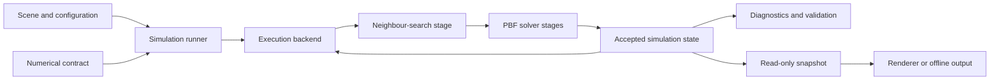
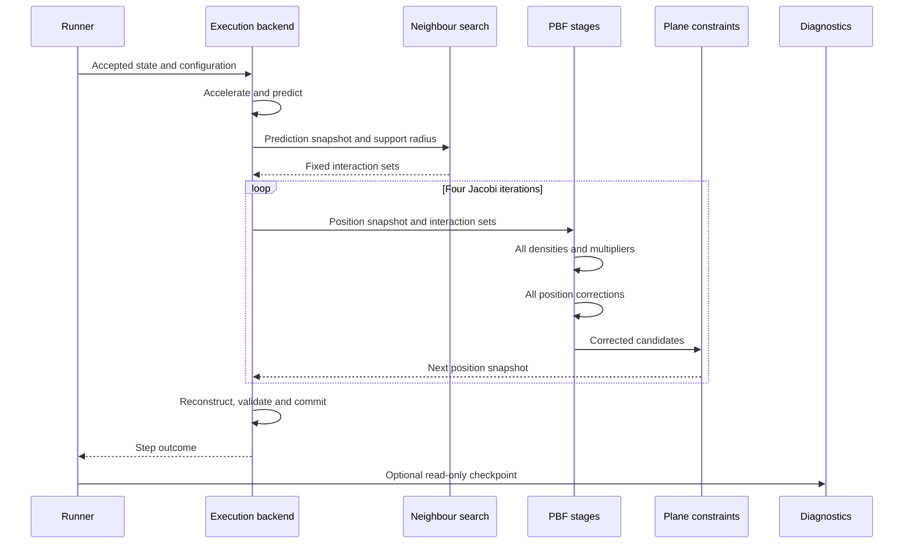

# Single-threaded brute force implementation. 

## Milestone overview

Creating the complete single-threaded CPU reference implementation using brute-force neighbour search.

## Starting point

At the start we have purely a boilerplate typical rust template. Comprising of mostly autogenerated files ( by cargo ):
- [Cargo.toml](/docs/project/development/00/assets/startpoint/Cargo.toml), which contains the project metadata. ( name, version etc )
- [Cargo.lock](/docs/project/development/00/assets/startpoint/Cargo.lock), an autogenerated project metadata. 

And other boilerplate git repository fluffer: 
- [.gitignore](/docs/project/development/00/assets/startpoint/.gitignore), *ignores* specigied files from version control ( git )
- [.gitattributes](/docs/project/development/00/assets/startpoint/.gitattributes), which contains fields to ensure accurate language diagnostics in [Maelstrom github](https://github.com/mahkrab/Maelstrom), removing Makefiles and Markdown files.

### Known constraints and assumptions

- This is the first step in the implementation of the project ( *finally some coding* ), where we will create a single-threaded CPU implementation of the PBF, so performance is purely for bassline purpouses.
- We expect this implementation to provide a deliberately simple reference, rather than assume it will be the *"worst"* for every workload. At small particle counts, a serial brute-force path may avoid the setup and transfer costs of later backends.
- The constraints of this implementation are likely to be:
  - Single-threaded execution prevents the simulation from using multiple CPU cores, but its measured effect will depend on the workload and particle count.
  - No GPU acceleration means this milestone cannot use GPU parallelism, but it does not by itself prove that a GPU backend will be faster for every workload.
  - Direct brute-force neighbour search performs a number of pair tests that grows quadratically with particle count, making it the expected scaling limit.

## Requirements and success criteria

| ID | Requirement | Type | Planned verification |
| --- | --- | --- | --- |
| M00-0 | Complete a single-threaded CPU nieve implementation of the 3D PBF simulation                 | Functional   | Headless tests and simulation runs |
| M00-1 | Use a brute fprce neighbout search as the reference neighbour search method                  | Functional   | Focused neighbout tests and implementation inspection |
| M00-2 | Produce deterministic results from identical intial state and configuration                  | Correctness  | Repeat identical headless simulations and compare results |
| M00-3 | Keep the simulation core independent from renderin, multithreading and CUDA                  | Architecture | Inspection and headless tests |
| M00-4 | Establish *correctness* and performance baselines that later milestones can compare against. | Benchmarking | Record tests and reproducible measurements |
| M00-5 | Provide a stable numerical value configuration to act as the testing scenario for later milestones. | Correctness | Inspection and headless tests |

## Research and design basis

A baseline for future optimisations, focusing on reproducible results, correctness over speed, and the ability to expand the application with other optimisations. 

### Original sources

- Macklin and Müllers PBF paper supplies the density constrain, correction equations, and simulation loop.<sup>[<a href="/docs/research/sources/004-macklin-muller-position-based-fluids.md">S004</a>]</sup>
- Muller, Charypar and Gross shows the underlying SPH interpolation and finite kernel definitions.<sup>[<a href="/docs/research/sources/003-muller-charypar-gross-particle-based-fluid-simulation.md">S003</a>]</sup>
- Witkin supplies the particle state, derivitive and force organisation foundations.<sup>[<a href="/docs/research/sources/014-witkin-particle-system-dynamics.md">S014</a>]</sup>

These sources seperate the three foundations needed for the numerical design.

### New sources

- The original position based dynamics paper defines the generic "inverse mass weighted projection" and state update structure behind PBF.<sup>[<a href="/docs/research/sources/050-muller-position-based-dynamics.md">S050</a>]</sup>
- THe Eurographics SPH report provides comparitive evidence for timestep policy, neighbout search design, density error measurement and the cost of iterative solvers.<sup>[<a href="/docs/research/sources/051-ihmsen-sph-fluids-computer-graphics.md">S051</a>]</sup>
- Akinci et al explain the solid boundary density deficiency identified by the PBF paper and provide a density aware boundary particle option.<sup>[<a href="/docs/research/sources/052-akinci-rigid-fluid-coupling.md">S052</a>]</sup>

These sources inform thr next decisions without predetermining Maelstroms timestep, iteration and boundary modelling.

### Design decisions

| Decision | Reason |
| --- | --- |
| Begin with a serial CPU backend | Provides the simplest implementation against whcih later parrallel backends can be checked |
| Begin with brute force neighbour search | Establlishes a direct reference before spatial partitioning changes neighbour discovery and performance |
| Keep rendering outside the simulation core | Correctness testa and performance measurements must be able to run without a display or rendering workload (for now) |
| Use one fixed numerical reference configuration | Later neighbour-search and execution backends must be compared using the same numerical method and workload |
| Use static plane boundaries throughout the optimisation study | Keeps boundary handling simple and prevents a boundary-method change from confounding performance comparisons |


## Initial design

### Numerical formulation

This is the source derived mathematical basis for the initial solver.

#### State and prediction

For particle $i$, let $\mathbf{x}_i$ be its position, $\mathbf{v}_i$ its velocity, $\mathbf{p}_i$ its predicted position and $\Delta t$ the timestep. External acceleration is applied befoe predicting position:

```math
\mathbf{v}_i^*=\mathbf{v}_i+\Delta t\,\mathbf{a}_{\mathrm{ext},i}
```

```math
\mathbf{p}_i=\mathbf{x}_i+\Delta t\,\mathbf{v}_i^*
```

Let $d_p$ be the particle diameter used by the timestep criteria. A velocity based SPH CFL check for a candidate fixed timestep is:

```math
\Delta t\leq
\lambda_{\mathrm{CFL}}
\frac{d_p}{\max_i\|\mathbf{v}_i^*\|}
```

This check uses the post-acceleration velocity that predicts displacement. If $`\max_i\|\mathbf{v}_i^*\|=0`$, the velocity criterion imposes no restriction. The fixed timestep, particle diameter and safety factor are still paremeter decisions; satisfying this one criterion is not by itself proof of stability.

### Brute force neighourhood 
*spiderman*

Let $h$ be the kernel support radius. The support set includes the particle itslf for densty estimation, while the interacation set excludes it.

```math
\mathcal{S}_i=\lbrace j\mid\|\mathbf{p}_i-\mathbf{p}_j\|<h\rbrace,
\qquad
\mathcal{N}_i=\mathcal{S}_i\setminus\{i\}
```

Milestone 00 obtains these sets by testing particle pairs directly, giving $\Theta(N^2)$ neughbour search.

### SPH kernels

For $`\mathbf{r}_{ij}=\mathbf{p}_i-\mathbf{p}_j`$ and
$`r_{ij}=\|\mathbf{r}_{ij}\|`$, density uses the three-dimensional Poly6 kernel:

```math
W_{\mathrm{poly6}}(r,h)=\dfrac{315}{64\pi h^9}(h^2-r^2)^3
\qquad \text{for }0\leq r\lt h
```

```math
W_{\mathrm{poly6}}(r,h)=0
\qquad \text{for }r\geq h
```

For $0<r<h$, the solver uses the Spiky kernel gradient. The operator $\mathbf{G}_{\mathrm{spiky}}$ below also records the numerical convention of returning zero at $r=0$:

```math
\mathbf{G}_{\mathrm{spiky}}(\mathbf{r},h)
=-\dfrac{45}{\pi h^6}(h-r)^2\dfrac{\mathbf{r}}{r}
\qquad \text{for }0\lt r\lt h
```

```math
\mathbf{G}_{\mathrm{spiky}}(\mathbf{r},h)=\mathbf{0}
\qquad \text{for }r=0\text{ or }r\geq h
```

The analytical vector gradient is undefined at $r=0$ because there is no unique direction for $\mathbf{r}/r$. Self interaction is excluded from the interaction set; for distinct particles at exactly the same position, returning zero is an implementation convention rather than an analytical result and supplies no separating direction.

### Density constraint

The initial formulation assumes equal particle mass absorbed ito the density scale, matchig the PBF derivation. Let $m$ be the common fluid-particle mass, $\rho_i^{\mathrm{phys}}$ the physical mass density and $\rho_0^{\mathrm{phys}}$ the physical rest density. The equal-mass solver uses the normalised density values $\widetilde{\rho}_i=\rho_i^{\mathrm{phys}}/m$ and $\widetilde{\rho}_0=\rho_0^{\mathrm{phys}}/m$:

```math
\rho_i^{\mathrm{phys}}
=m\sum_{j\in\mathcal{S}_i}W_{\mathrm{poly6}}(r_{ij},h),
\qquad
\widetilde{\rho}_i
=\sum_{j\in\mathcal{S}_i}W_{\mathrm{poly6}}(r_{ij},h)
```

```math
C_i(\mathbf{p})
=\frac{\widetilde{\rho}_i}{\widetilde{\rho}_0}-1
=\frac{\rho_i^{\mathrm{phys}}}{\rho_0^{\mathrm{phys}}}-1
```

Density uses Poly6 while the PBF solver intentionally substitutes the Spiky operator when calculating its correction directions. Therefore, define $\mathbf{g}_k^{(i)}$ as the solver's substituted constraint-gradient direction, rather than the analytical gradient of the Poly6 density constraint:

```math
\mathbf{g}_k^{(i)}=
\begin{cases}
\dfrac{1}{\widetilde{\rho}_0}\displaystyle\sum_{j\in\mathcal{N}_i}
\mathbf{G}_{\mathrm{spiky}}(\mathbf{r}_{ij},h), & k=i,\\[1.2em]
-\dfrac{1}{\widetilde{\rho}_0}\mathbf{G}_{\mathrm{spiky}}(\mathbf{r}_{ik},h),
& k\in\mathcal{N}_i,\\[0pt]
\mathbf{0}, & \text{otherwise.}
\end{cases}
```

### Jacobi constraint projection

The generic position based correction for constraint $C_i$ uses inverse mass $w_k=1/m_k$:

```math
\Delta\mathbf{p}_k^{(i)}
=
-\frac{w_k C_i}
{\displaystyle\sum_jw_j\left\|\nabla_{\mathbf{p}_j}C_i\right\|^2+\varepsilon}
\nabla_{\mathbf{p}_k}C_i
```

A fixed particle has $w_k=0$. Under the equal mass PBF formulation, the fluid specific constraint multiplier for relaxation value $\varepsilon>0$ is:

```math
\lambda_i=
-\frac{C_i}
{\displaystyle\sum_k\left\|\mathbf{g}_k^{(i)}\right\|^2+\varepsilon}
```

The optional artificial pressure term used to resist particle clumping is:

```math
s_{\mathrm{corr},ij}
=
-k_{\mathrm{corr}}
\left(
\frac{W_{\mathrm{poly6}}(r_{ij},h)}
{W_{\mathrm{poly6}}(\Delta q,h)}
\right)^{n_{\mathrm{corr}}}
```

Here $k_{\mathrm{corr}}\geq0$ controls its strength, $0<\Delta q<h$ is a fixed
reference separation and $n_{\mathrm{corr}}>0$ controls how sharply the
repulsion grows at short distances. Their reference values are fixed in the
reference numerical configuration below and remain configurable.

The resulting total correction for fluid particle $i$ is:

```math
\Delta\mathbf{p}_i=
\frac{1}{\widetilde{\rho}_0}
\sum_{j\in\mathcal{N}_i}
\left(\lambda_i+\lambda_j+s_{\mathrm{corr},ij}\right)
\mathbf{G}_{\mathrm{spiky}}(\mathbf{r}_{ij},h)
```

Each solver iteration must calculate every $\lambda_i$ from the same predicted state, calculate every $\Delta\mathbf{p}_i$ from that state and only then be able to apply:

```math
\mathbf{p}_i\leftarrow\mathbf{p}_i+\Delta\mathbf{p}_i
```

This explicit Jacobi ordering is part of the reference behaviour, even though the implementation is single threaded.

### Velocity reconstruction and density error

After the final solver iteration:

```math
\mathbf{v}_i\leftarrow\frac{\mathbf{p}_i-\mathbf{x}_i}{\Delta t},
\qquad
\mathbf{x}_i\leftarrow\mathbf{p}_i
```

The baseline should record both mean and maximum relative density error over a evaluation set $\mathcal{E}$:

```math
e_i=\left|\frac{\widetilde{\rho}_i}{\widetilde{\rho}_0}-1\right|,
\qquad
E_{\mathrm{mean}}=\frac{1}{|\mathcal{E}|}\sum_{i\in\mathcal{E}}e_i,
\qquad
E_{\max}=\max_{i\in\mathcal{E}}e_i
```

### Boundary alternatives

A simple static plane can be represneted by a unit normal $\mathbf{n}$ and permitted offset $d$:

```math
C_{\mathrm{plane}}(\mathbf{p}_i)=\mathbf{n}\cdot\mathbf{p}_i-d\geq0
```

If $C_{\mathrm{plane}}<0$, non penetration is restored with:

```math
\mathbf{p}_i\leftarrow
\mathbf{p}_i-C_{\mathrm{plane}}(\mathbf{p}_i)\mathbf{n}
```

The density aware alternatives uses explicit fluid masses and assigns each boundary sample $b$ a volme and SPH pseudo-mass:

```math
V_b=\left(\sum_l W(\mathbf{x}_b-\mathbf{x}_l,h)\right)^{-1},
\qquad
\Psi_b=\rho_0^{\mathrm{phys}}V_b
```

The pseudo-mass weights the boundary sample's density contribution; it is not the rigid body's inertial mass. Its contribution is then added to the physical fluid density:

```math
\rho_i^{\mathrm{phys}}=
\sum_{j\in\mathcal{S}_i}m_jW(\mathbf{p}_i-\mathbf{p}_j,h)
+
\sum_{b\in\mathcal{B}_i}\Psi_bW(\mathbf{p}_i-\mathbf{x}_b,h)
```

For equal fluid mass $m$, this alternative maps into the normalised solver with $\widetilde{\Psi}_b=\Psi_b/m$. It must change the substituted direction for particle $i$ as well as the density:

```math
\mathbf{g}_i^{(i)}
=
\frac{1}{\widetilde{\rho}_0}
\left[
\sum_{j\in\mathcal{N}_i}
\mathbf{G}_{\mathrm{spiky}}(\mathbf{r}_{ij},h)
+
\sum_{b\in\mathcal{B}_i}
\widetilde{\Psi}_b
\mathbf{G}_{\mathrm{spiky}}(\mathbf{p}_i-\mathbf{x}_b,h)
\right]
```

For a static boundary, the boundary samples do not receive position corrections or own density constraints. The corresponding fluid-particle correction is:

```math
\Delta\mathbf{p}_i
=
\frac{1}{\widetilde{\rho}_0}
\left[
\sum_{j\in\mathcal{N}_i}
\left(\lambda_i+\lambda_j+s_{\mathrm{corr},ij}\right)
\mathbf{G}_{\mathrm{spiky}}(\mathbf{r}_{ij},h)
+
\lambda_i
\sum_{b\in\mathcal{B}_i}
\widetilde{\Psi}_b
\mathbf{G}_{\mathrm{spiky}}(\mathbf{p}_i-\mathbf{x}_b,h)
\right]
```

The reference solver selects plane projection. The density-aware model is retained above as a
researched alternative, but it is outside Milestones 00 to 03 unless a later, separately documented
revision changes the experimental design.

### Reference numerical configuration

The following configuration is the canonical correctness and performance reference. Every value
must remain configurable, but a run that changes one must record the deviation and must not be
presented as directly comparable with the reference results.

| Parameter or policy | Reference decision | Reason |
| --- | --- | --- |
| Scalar precision | IEEE-754 binary32 ( f32 ) for simulation state and solver arithmetic | Uses precision floats supported efficiently by the serial CPU, multithreaded CPU and CUDA targets |
| Units and axes | Metres, seconds and kilograms, right-handed coordinates with positive $y$ upward | Makes configuration, diagnostics and scenes simpler |
| External acceleration | $\mathbf{a}_{\mathrm{ext}}=(0,-9.81,0)\,\mathrm{m\,s^{-2}}$ | Defines the water like gravity workload used by the reference scene |
| Fixed timestep | $\Delta t=1/120\,\mathrm{s}$ | Provides a conservative fixed update rate while keeping every backend on identical timesteps |
| CFL diagnostic | $\lambda_{\mathrm{CFL}}=0.4$ using $d_p$ and post-acceleration velocity | Uses the sources safety factor as a diagnostic. |
| Particle spacing and diameter | $\Delta x=d_p=0.05\,\mathrm{m}$ | Defines the initial cubic lattice and the displacement scale used by the CFL check |
| Kernel support | $h=2\Delta x=0.10\,\mathrm{m}$ | Gives a fixed support-to-spacing ratio and a useful three-dimensional reference neighbourhood |
| Physical rest density | $\rho_0^{\mathrm{phys}}=1000\,\mathrm{kg\,m^{-3}}$ | Defines a nominal water like project convention rather than exact material modelling |
| Particle mass and normalised rest density | Derived from the interior reference lattice as shown below | Makes the initial interior lattice satisfy the discrete density target instead of assuming exact kernel quadrature *fancy* |
| Solver iterations | Four Jacobi iterations per timestep | Uses the upper end of the paper's typical two-to-four iteration range and fixes solver work per step |
| Relaxation | $\varepsilon=10^{-6}h^{-2}=10^{-4}\,\mathrm{m^{-2}}$ | Supplies a small scaleaware denominator without treating it as a tuned material property |
| Artificial pressure | Enabled with $k_{\mathrm{corr}}=0.1h^2=0.001\,\mathrm{m^2}$, $\Delta q=0.2h=0.02\,\mathrm{m}$ and $n_{\mathrm{corr}}=4$ | Uses the paper's reported strength, exponent and midpoint of its reference-separation range, scaled to Maelstrom's length units |
| Boundary model | Static unit-normal planes with projection, no boundary density contribution, restitution or friction | Produces a small, deterministic boundary contract that can remain unchanged across backends |
| Optional velocity effects | XSPH viscosity and vorticity confinement disabled | Keeps the first baseline focused on the required density solver, either effect would require its own later decision and comparison |
| Neighbour rebuild | Once per timestep after position prediction; distances and kernel values recalculated during every solver iteration | Matches the PBF algorithm while keeping neighbour discovery a separately measurable stage |
| Particle order | Stable ascending particle identifier in the serial reference | Makes repeated serial runs and diagnosis reproducible without requiring later parallel reductions to be bitwise identical |
| Density error audit | $\mathcal{E}$ contains every fluid particle, validation checkpoints recompute density from final positions using a fresh brute force support search | Avoids selectively hiding freesurface or plane-boundary error without changing solver state or including the audit in timed solver work |

For an interior particle on the infinite cubic reference lattice, let
$\mathcal{L}=\{\Delta x(a,b,c)\mid a,b,c\in\mathbb{Z},\ \|\Delta x(a,b,c)\|<h\}$.
For $h=2\Delta x$, this set contains 27 sample offsets. The reference normalised rest density
and common mass are derived by:

```math
\widetilde{\rho}_0
=
\sum_{\mathbf{r}\in\mathcal{L}}W_{\mathrm{poly6}}(\|\mathbf{r}\|,h)
\approx8078.201335\,\mathrm{m^{-3}}
```

```math
m
=
\frac{\rho_0^{\mathrm{phys}}}{\widetilde{\rho}_0}
\approx0.123789933\,\mathrm{kg}
```

These derived values must be reproduced by a kernel-and-lattice test rather than trusted only as
copied constants. Scalability workloads should change the domain and particle count while retaining
this spacing, support ratio and numerical configuration.

Under this normalisation, $\mathbf{g}_k^{(i)}$ has units of $\mathrm{m^{-1}}$.
Consequently, $\varepsilon$ has units of $\mathrm{m^{-2}}$, while $\lambda_i$ and
$s_{\mathrm{corr},ij}$ have units of $\mathrm{m^2}$. Expressing the relaxation as a multiple of
$h^{-2}$ and artificial-pressure strength as a multiple of $h^2$ preserves those dimensions.

The reference runner must record the maximum post-acceleration speed and the resulting CFL limit
on every step. If the fixed timestep exceeds that limit, it must report the reference run as outside
the selected numerical contract rather than silently changing $\Delta t$.


### Architecture

The planned architecture separates stable behaviour from replaceable implementation. Scene construction
and configuration provide deterministic inputs to a headless runner. The selected execution backend owns
the physical layout of its working state and executes the numerical contract using a neighbour-search
implementation. Diagnostics and rendering can observe explicit snapshots but cannot mutate a simulation
step.



Milestone 00 composes the serial CPU backend with brute-force search. Later milestones may replace the
search stage, execution backend and physical data layout independently, provided that their observable
behaviour satisfies the same contracts.

### Data and execution flow

#### Neighbour-set contract

After prediction, the search stage builds one interaction set from the position snapshot
$\mathbf{p}^{(0)}$:

```math
\mathcal{N}_i^{(0)}
=
\left\{j\ne i\mid
\left\|\mathbf{p}_i^{(0)}-\mathbf{p}_j^{(0)}\right\|<h
\right\}
```

The serial brute-force implementation returns valid, duplicate-free indices in ascending particle-ID
order.

The set is not rebuilt during the four solver iterations. Every iteration recalculates distances and
kernels from its current position snapshot and therefore naturally ignores an original neighbour that has
moved to $r\geq h$. A particle that newly moves inside $h$ is not added until the next timestep. This is a
deliberate property of the selected PBF algorithm and must remain consistent across backends.

#### Timestep contract

For accepted state $(\mathbf{x}^n,\mathbf{v}^n)$, one timestep performs the following ordered stages:

1. Validate the configuration, plane normals, particle indices and finiteness of the accepted state.
   An empty particle set is valid and produces an unchanged successful step.
2. Calculate every post-acceleration velocity $\mathbf{v}_i^*$ without changing the accepted state. Record
   maximum speed and whether the fixed timestep exceeds the CFL diagnostic limit; a violation is reported
   but does not silently alter $\Delta t$.
3. Calculate every initial prediction $\mathbf{p}_i^{(0)}$ from $\mathbf{x}_i^n$ and
   $\mathbf{v}_i^*$.
4. Build every fixed interaction set $\mathcal{N}_i^{(0)}$ from the complete prediction snapshot.
5. Repeat exactly four Jacobi iterations. For iteration $l$:
   1. Read only $\mathbf{p}^{(l)}$ and $\mathcal{N}^{(0)}$ while calculating all densities,
      constraints, substituted directions and multipliers.
   2. Read the same position snapshot and the complete multiplier array while calculating every
      $\Delta\mathbf{p}_i^{(l)}$ into separate storage.
   3. Form every candidate $\mathbf{q}_i=\mathbf{p}_i^{(l)}+\Delta\mathbf{p}_i^{(l)}$.
   4. Project each candidate against every configured plane in configuration order and write the result
      to $\mathbf{p}_i^{(l+1)}$. Plane projection is therefore applied once per iteration.
6. Reconstruct every final velocity from $\mathbf{p}^{(4)}-\mathbf{x}^n$, then check that all proposed
   positions and velocities are finite.
7. If validation succeeds, accept all new positions and velocities together as state
   $(\mathbf{x}^{n+1},\mathbf{v}^{n+1})$. A failure must not expose a partially committed state.
8. Return the step outcome, including the CFL diagnostic and any explicitly enabled stage measurements.
   Rendering and correctness audits occur only through read-only state observations.

The repeated stages are summarised below. The diagram describes planned behaviour, not an implemented or
verified call structure.



#### Correctness audit and timing boundary

At requested validation checkpoints, diagnostics perform a fresh brute-force support search over the
accepted final positions and recompute $E_{\mathrm{mean}}$ and $E_{\max}$ for every fluid particle. This
audit detects density error independently of the solver's fixed neighbour approximation. It does not feed
neighbours or corrected values back into the simulation.

The audit is outside the timed simulation step and is disabled during primary throughput measurements
except at declared checkpoints. Timed stage measurements distinguish neighbour search, density and
multiplier calculation, correction and plane projection, and total backend step time. Later CUDA results
must additionally report required synchronisation and transfer costs rather than hiding them inside an
unlabelled total.

#### Backend-equivalence rules

- All primary comparisons use the reference configuration, initial state, timestep count and four-iteration
  Jacobi contract.
- The serial reference preserves ascending neighbour and particle order and must reproduce identical output
  for repeated runs on the same supported environment.
- Parallel backends may reorder independent work and floating-point reductions. They are compared with
  documented tolerances rather than required to be bitwise identical.
- A backend may fuse stages only when every logical Jacobi read observes the same position and multiplier
  snapshots defined above.
- Approximate mathematics, reduced precision, adaptive timesteps, different iteration counts and compiler
  fast-math modes are separate experimental variants, not silent backend optimisations.
- Diagnostics, logging and rendering must not alter state or be included selectively in only one backend's
  primary timing.

### Risks and unresolved questions

| Risk or question | Planned response |
| --- | --- |
| The selected reference values may expose instability or poor density behaviour when implemented | Test them against deterministic lattice and falling-fluid scenes; preserve the observation and revise the design only when evidence requires it |
| Brute force neighbout search will re strict the particle counts that can be tested initially, but as a basline, correctness takes priority | Keep it as the reference and measure its limits using reproducible worklods |
| Later backends could change simulation behaviour rather than only execution | Apply the backend-equivalence rules and treat altered precision, mathematics, parameters or stage semantics as separately labelled experimental variants |
| Software level improvements could become confused with the planned algorithm and hardware milestones | Profile the named stages, preserve the numerical contract and record substantial layout, allocation, vectorisation or compiler changes separately |


## Implementation record

### Stage 1: source-derived numerical contract

#### Intention

Find the equations, algorithm stages, assumptions and guidance from the compiled sources, before selecting Maelstrom's algorithms or writing solver code.

#### Work completed

- Added all three new sources to the source register and BibTeX database.
- Extracted the sources equations into the numerical formulation.
- Completed the missing artificial pressure equation and without selecting the reference parameter values.
- Selected a canonical numerical reference configuration for controlled backend comparisons.

#### Evidence and observations

- [Initial numerical formulation](/docs/project/development/00/serial-brute-force.md#numerical-formulation)
- [Artificial-pressure explanation](/docs/project/development/00/explation.md#artificial-pressure)
- [Reference numerical configuration](/docs/project/development/00/serial-brute-force.md#reference-numerical-configuration)

### Stage 2: execution and architecture contract

#### Intention

Define the exact timestep semantics and stable responsibility boundaries before implementation, while
leaving physical data layout and backend-specific optimisation open.

#### Work completed

- Defined the neighbour set behaviour and its approximation across solver iterations.
- Defined the ordered four-iteration Jacobi step, per-iteration plane projection, validation and atomic
  accepted-state update.
- Separated execution, neighbour discovery, diagnostics and rendering responsibilities without prescribing
  one code layout.
- Defined the correctness-audit, timing and later backend-equivalence boundaries.

#### Evidence and observations

- [Planned architecture](/docs/project/development/00/serial-brute-force.md#architecture)
- [Timestep contract](/docs/project/development/00/serial-brute-force.md#timestep-contract)
- [Backend-equivalence rules](/docs/project/development/00/serial-brute-force.md#backend-equivalence-rules)

The contract allows serial, multithreaded and CUDA implementations to use different storage and execution
strategies. Their primary comparison remains meaningful only while the numerical configuration and logical
Jacobi snapshots remain unchanged.

## Problems, diagnosis and revisions

### Revised design

## Final implementation

### Architecture and behaviour

### Implementation references

### Deviations from the initial design

## Verification

### Environment

### Correctness and behaviour tests

### Performance evidence

## Evaluation

### Requirements evaluation

### Contribution to the research question

### Strengths

### Weaknesses and limitations

## Conclusion and next milestone

## Related records
