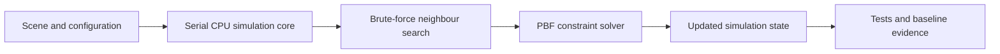

# Single-threaded brute force implementation. 

## Milestone overview

Creating the complete single-threaded CPU reference implementation using brute-force neighbour search.

## Starting point

At the start we have purely a boilerplate typical rust template. Comprising of mostly autogenerated files ( by cargo ):
- [Cargo.toml](/docs/project/development/00/assets/startpoint/Cargo.toml), which contains the project metadata. ( name, version etc )
- [Cargo.lock](/docs/project/development/00/assets/startpoint/Cargo.lock), an autogenerated project metadata. 

And other boilerplate git repository fluffer: 
- [.gitignore](/docs/project/development/00/assets/startpoint/.gitignore), *ignores* specigied files from version control ( git )
- [.gitattributes](/docs/project/development/00/assets/startpoint/.gitattributes), which contains fields to ensure accurate language diagnostics in [Maelstrom github](https://github.com/mahkrab/Maelstrom), removing Makefiles and Markdown files.

### Known constraints and assumptions

- This is the first step in the implementation of the project ( *finally some coding* ), where we will create a single-threaded CPU implementation of the PBF, so performance is purely for bassline purpouses.
- We expect this implementation to provide a deliberately simple reference, rather than assume it will be the *"worst"* for every workload. At small particle counts, a serial brute-force path may avoid the setup and transfer costs of later backends.
- The constraints of this implementation are likely to be:
  - Single-threaded execution prevents the simulation from using multiple CPU cores, but its measured effect will depend on the workload and particle count.
  - No GPU acceleration means this milestone cannot use GPU parallelism, but it does not by itself prove that a GPU backend will be faster for every workload.
  - Direct brute-force neighbour search performs a number of pair tests that grows quadratically with particle count, making it the expected scaling limit.

## Requirements and success criteria

| ID | Requirement | Type | Planned verification |
| --- | --- | --- | --- |
| M00-0 | Complete a single-threaded CPU nieve implementation of the 3D PBF simulation                 | Functional   | Headless tests and simulation runs |
| M00-1 | Use a brute fprce neighbout search as the reference neighbour search method                  | Functional   | Focused neighbout tests and implementation inspection |
| M00-2 | Produce deterministic results from identical intial state and configuration                  | Correctness  | Repeat identical headless simulations and compare results |
| M00-3 | Keep the simulation core independent from renderin, multithreading and CUDA                  | Architecture | Inspection and headless tests |
| M00-4 | Establish *correctness* and performance baselines that later milestones can compare against. | Benchmarking | Record tests and reproducible measurements |

## Research and design basis

A baseline for future optimisations, focusing on reproducible results, correctness over speed, and the ability to expand the application with other optimisations. 

### Original sources

- Macklin and Müllers PBF paper supplies the density constrain, correction equations, and simulation loop.<sup>[<a href="/docs/research/sources/004-macklin-muller-position-based-fluids.md">S004</a>]</sup>
- Muller, Charypar and Gross shows the underlying SPH interpolation and finite kernel definitions.<sup>[<a href="/docs/research/sources/003-muller-charypar-gross-particle-based-fluid-simulation.md">S003</a>]</sup>
- Witkin supplies the particle state, derivitive and force organisation foundations.<sup>[<a href="/docs/research/sources/014-witkin-particle-system-dynamics.md">S014</a>]</sup>

These sources seperate the three foundations needed for the numerical design.

### New sources

- The original position based dynamics paper defines the generic "inverse mass weighted projection" and state update structure behind PBF.<sup>[<a href="/docs/research/sources/050-muller-position-based-dynamics.md">S050</a>]</sup>
- THe Eurographics SPH report provides comparitive evidence for timestep policy, neighbout search design, density error measurement and the cost of iterative solvers.<sup>[<a href="/docs/research/sources/051-ihmsen-sph-fluids-computer-graphics.md">S051</a>]</sup>
- Akinci et al explain the solid boundary density deficiency identified by the PBF paper and provide a density aware boundary particle option.<sup>[<a href="/docs/research/sources/052-akinci-rigid-fluid-coupling.md">S052</a>]</sup>

These sources inform thr next decisions without predetermining Maelstroms timestep, iteration and boundary modelling.

### Design decisions

| Decision | Reason |
| --- | --- |
| Begin with a serial CPU backend | Provides the simplest implementation against whcih later parrallel backends can be checked |
| Begin with brute force neighbour search | Establlishes a direct reference before spatial partitioning changes neighbour discovery and performance |
| Keep rendering outside the simulation core | Correctness testa and performance measurements must be able to run without a display or rendering workload (for now) |


## Initial design

### Numerical formulation

This is the source derived mathematical basis for the initial solver.

#### State and prediction

For particle $i$, let $\mathbf{x}_i$ be its position, $\mathbf{v}_i$ its velocity, $\mathbf{p}_i$ its predicted position and $\Delta t$ the timestep. External acceleration is applied befoe predicting position:

```math
\mathbf{v}_i^*=\mathbf{v}_i+\Delta t\,\mathbf{a}_{\mathrm{ext},i}
```

```math
\mathbf{p}_i=\mathbf{x}_i+\Delta t\,\mathbf{v}_i^*
```

Let $d_p$ be the particle diameter used by the timestep criteria. A velocity based SPH CFL check for a candidate fixed timestep is:

```math
\Delta t\leq
\lambda_{\mathrm{CFL}}
\frac{d_p}{\max_i\|\mathbf{v}_i^*\|}
```

This check uses the post-acceleration velocity that predicts displacement. If $`\max_i\|\mathbf{v}_i^*\|=0`$, the velocity criterion imposes no restriction. The fixed timestep, particle diameter and safety factor are still paremeter decisions; satisfying this one criterion is not by itself proof of stability.

### Brute force neighourhood 
*spiderman*

Let $h$ be the kernel support radius. The support set includes the particle itslf for densty estimation, while the interacation set excludes it.

```math
\mathcal{S}_i=\lbrace j\mid\|\mathbf{p}_i-\mathbf{p}_j\|<h\rbrace,
\qquad
\mathcal{N}_i=\mathcal{S}_i\setminus\{i\}
```

Milestone 00 obtains these sets by testing particle pairs directly, giving $\Theta(N^2)$ neughbour search.

### SPH kernels

For $`\mathbf{r}_{ij}=\mathbf{p}_i-\mathbf{p}_j`$ and
$`r_{ij}=\|\mathbf{r}_{ij}\|`$, density uses the three-dimensional Poly6 kernel:

```math
W_{\mathrm{poly6}}(r,h)=
\begin{cases}
\dfrac{315}{64\pi h^9}(h^2-r^2)^3, & 0\leq r<h,\cr
0, & r\geq h.
\end{cases}
```

For $0<r<h$, the solver uses the Spiky kernel gradient. The operator $\mathbf{G}_{\mathrm{spiky}}$ below also records the numerical convention of returning zero at $r=0$:

```math
\mathbf{G}_{\mathrm{spiky}}(\mathbf{r},h)=
\begin{cases}
-\dfrac{45}{\pi h^6}(h-r)^2\dfrac{\mathbf{r}}{r}, & 0<r<h,\cr
\mathbf{0}, & r=0\ \text{or}\ r\geq h.
\end{cases}
```

The analytical vector gradient is undefined at $r=0$ because there is no unique direction for $\mathbf{r}/r$. Self interaction is excluded from the interaction set; for distinct particles at exactly the same position, returning zero is an implementation convention rather than an analytical result and supplies no separating direction.

### Density constraint

The initial formulation assumes equal particle mass absorbed ito the density scale, matchig the PBF derivation. Let $m$ be the common fluid-particle mass, $\rho_i^{\mathrm{phys}}$ the physical mass density and $\rho_0^{\mathrm{phys}}$ the physical rest density. The equal-mass solver uses the normalised density values $\widetilde{\rho}_i=\rho_i^{\mathrm{phys}}/m$ and $\widetilde{\rho}_0=\rho_0^{\mathrm{phys}}/m$:

```math
\rho_i^{\mathrm{phys}}
=m\sum_{j\in\mathcal{S}_i}W_{\mathrm{poly6}}(r_{ij},h),
\qquad
\widetilde{\rho}_i
=\sum_{j\in\mathcal{S}_i}W_{\mathrm{poly6}}(r_{ij},h)
```

```math
C_i(\mathbf{p})
=\frac{\widetilde{\rho}_i}{\widetilde{\rho}_0}-1
=\frac{\rho_i^{\mathrm{phys}}}{\rho_0^{\mathrm{phys}}}-1
```

Density uses Poly6 while the PBF solver intentionally substitutes the Spiky operator when calculating its correction directions. Therefore, define $\mathbf{g}_k^{(i)}$ as the solver's substituted constraint-gradient direction, rather than the analytical gradient of the Poly6 density constraint:

```math
\mathbf{g}_k^{(i)}=
\begin{cases}
\dfrac{1}{\widetilde{\rho}_0}\displaystyle\sum_{j\in\mathcal{N}_i}
\mathbf{G}_{\mathrm{spiky}}(\mathbf{r}_{ij},h), & k=i,\\[1.2em]
-\dfrac{1}{\widetilde{\rho}_0}\mathbf{G}_{\mathrm{spiky}}(\mathbf{r}_{ik},h),
& k\in\mathcal{N}_i,\cr
\mathbf{0}, & \text{otherwise.}
\end{cases}
```

### Jacobi constraint projection

The generic position based correction for constraint $C_i$ uses inverse mass $w_k=1/m_k$:

```math
\Delta\mathbf{p}_k^{(i)}
=
-\frac{w_k C_i}
{\displaystyle\sum_jw_j\left\|\nabla_{\mathbf{p}_j}C_i\right\|^2+\varepsilon}
\nabla_{\mathbf{p}_k}C_i
```

A fixed particle has $w_k=0$. Under the equal mass PBF formulation, the fluid specific constraint multiplier for relaxation value $\varepsilon>0$ is:

```math
\lambda_i=
-\frac{C_i}
{\displaystyle\sum_k\left\|\mathbf{g}_k^{(i)}\right\|^2+\varepsilon}
```

The optional artificial pressure term used to resist particle clumping is:

```math
\Delta\mathbf{p}_i=
\frac{1}{\widetilde{\rho}_0}
\sum_{j\in\mathcal{N}_i}
\left(\lambda_i+\lambda_j+s_{\mathrm{corr},ij}\right)
\mathbf{G}_{\mathrm{spiky}}(\mathbf{r}_{ij},h)
```

Each solver iteration must calculate every $\lambda_i$ from the same predicted state, calculate every $\Delta\mathbf{p}_i$ from that state and only then be able to apply:

```math
\mathbf{p}_i\leftarrow\mathbf{p}_i+\Delta\mathbf{p}_i
```

This explicit Jacobi ordering is part of the reference behaviour, even though the implementation is single threaded.

### Velocity reconstruction and density error

After the final solver iteration:

```math
\mathbf{v}_i\leftarrow\frac{\mathbf{p}_i-\mathbf{x}_i}{\Delta t},
\qquad
\mathbf{x}_i\leftarrow\mathbf{p}_i
```

The baseline should record both mean and maximum relative density error over a evaluation set $\mathcal{E}$:

```math
e_i=\left|\frac{\widetilde{\rho}_i}{\widetilde{\rho}_0}-1\right|,
\qquad
E_{\mathrm{mean}}=\frac{1}{|\mathcal{E}|}\sum_{i\in\mathcal{E}}e_i,
\qquad
E_{\max}=\max_{i\in\mathcal{E}}e_i
```

### Boundary alternatives

A simple static plane can be represneted by a unit normal $\mathbf{n}$ and permitted offset $d$:

```math
C_{\mathrm{plane}}(\mathbf{p}_i)=\mathbf{n}\cdot\mathbf{p}_i-d\geq0
```

If $C_{\mathrm{plane}}<0$, non penetration is restored with:

```math
\mathbf{p}_i\leftarrow
\mathbf{p}_i-C_{\mathrm{plane}}(\mathbf{p}_i)\mathbf{n}
```

The density aware alternatives uses explicit fluid masses and assigns each boundary sample $b$ a volme and SPH pseudo-mass:

```math
V_b=\left(\sum_l W(\mathbf{x}_b-\mathbf{x}_l,h)\right)^{-1},
\qquad
\Psi_b=\rho_0^{\mathrm{phys}}V_b
```

The pseudo-mass weights the boundary sample's density contribution; it is not the rigid body's inertial mass. Its contribution is then added to the physical fluid density:

```math
\rho_i^{\mathrm{phys}}=
\sum_{j\in\mathcal{S}_i}m_jW(\mathbf{p}_i-\mathbf{p}_j,h)
+
\sum_{b\in\mathcal{B}_i}\Psi_bW(\mathbf{p}_i-\mathbf{x}_b,h)
```

For equal fluid mass $m$, this alternative maps into the normalised solver with $\widetilde{\Psi}_b=\Psi_b/m$. It must change the substituted direction for particle $i$ as well as the density:

```math
\mathbf{g}_i^{(i)}
=
\frac{1}{\widetilde{\rho}_0}
\left[
\sum_{j\in\mathcal{N}_i}
\mathbf{G}_{\mathrm{spiky}}(\mathbf{r}_{ij},h)
+
\sum_{b\in\mathcal{B}_i}
\widetilde{\Psi}_b
\mathbf{G}_{\mathrm{spiky}}(\mathbf{p}_i-\mathbf{x}_b,h)
\right]
```

For a static boundary, the boundary samples do not receive position corrections or own density constraints. The corresponding fluid-particle correction is:

```math
\Delta\mathbf{p}_i
=
\frac{1}{\widetilde{\rho}_0}
\left[
\sum_{j\in\mathcal{N}_i}
\left(\lambda_i+\lambda_j+s_{\mathrm{corr},ij}\right)
\mathbf{G}_{\mathrm{spiky}}(\mathbf{r}_{ij},h)
+
\lambda_i
\sum_{b\in\mathcal{B}_i}
\widetilde{\Psi}_b
\mathbf{G}_{\mathrm{spiky}}(\mathbf{p}_i-\mathbf{x}_b,h)
\right]
```

Only one boundary model will be selected for the initial, and further implementations.

## Parameter decisions still required

| Parameter or policy | Role |
| --- | --- |
| $\Delta t$ | Fixed timestep |
| $\Delta x$ and $d_p$ | Initial particle spacing and characteristic particle diameter |
| $h$ | Kernel support radius; $h/\Delta x$ controls neighbourhood sampling |
| $m$ and $\rho_0^{\mathrm{phys}}$ | Common particle mass and physical rest density; $\widetilde{\rho}_0=\rho_0^{\mathrm{phys}}/m$ is the derived normalised scale |
| Solver iteration count | Deterministic runtime and density convergence |
| $\varepsilon$ | Regularisation of small constraint-gradient denominators |
| $k_{\mathrm{corr}},\Delta q,n_{\mathrm{corr}}$ | Artificial-pressure behaviour |
| Boundary model | Simple plane projection or density-aware boundary particles |
| Evaluation set $\mathcal{E}$ | Which particles contribute to reported density error |


### Architecture

The initial architecture centres on one headless serial simulation path. Sceen construction and configuration provide input to the simulation corel. The core *owns* the PBF solver and uses brute force neighbour search. Its resultant state can then be the baseline for future testing.



### Data and execution flow

The simulation will begin with explicit configuration ( scene/material/config information ) Each step will find the neighbours by brute force, apply the selected PBF process and produce updated state. The exact state representation, step pages and numerial conventions are undecided.

### Risks and unresolved questions

| Risk or question | Planned response |
| --- | --- |
| The detailed PBF equations, parameters and detailed implementation notes are not determined yet, but needed sources and infastructure is complete | Complete the focused algorithm design from sources before implementing the solver |
| Brute force neighbout search will re strict the particle counts that can be tested initially, but as a basline, correctness takes priority | Keep it as the reference and measure its limits using reproducible worklods |
| Later backends could change simulation behavior rather than only execution methods | although With the project focus on optimization and  correctness retainment, reproducible results will be vital |
| Inablitiy to know which parts to optimise; e.g. the software implementation, should i always use the highest performance option in terms of implementation, and focusing on witholding optimizations when the optimization is based on large milestones etc | We will focus on always using the best software options, when it is purely software implementationary and non theoretical *odd wording come back later* |


## Implementation record

### Stage 1:

#### Intention

Find the equations, algorithm stages, assumptions and guidance from the compiled sources, before selecting Maelstrom's algorithms or writing solver code.

#### Work completed

- Added all three new sources to the source register and BibTeX database.
- Extracted the source-derived equations into the numerical formulation rather than duplicating
  them as reading notes in each source record.

#### Evidence and observations

- [Initial numerical formulation](/docs/project/development/00/serial-brute-force.md#numerical-formulation)

## Problems, diagnosis and revisions

### Revised design

## Final implementation

### Architecture and behaviour

### Implementation references

### Deviations from the initial design

## Verification

### Environment

### Correctness and behaviour tests

### Performance evidence

## Evaluation

### Requirements evaluation

### Contribution to the research question

### Strengths

### Weaknesses and limitations

## Conclusion and next milestone

## Related records
