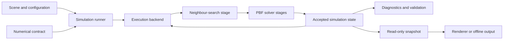
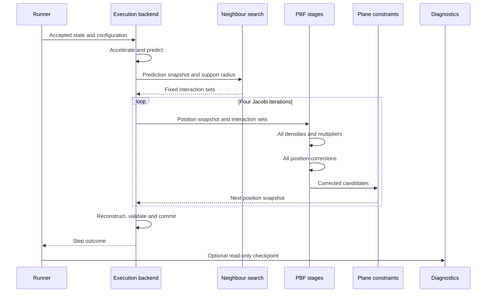

# Phase 0 design contract

## Contract status and authority

This record owns the normative Milestone 00's numerical and behavioural guidelines. The
[mathematics explanation](/docs/project/development/milestones/00/explation.md) explains the same mathematics in simple language but does not
override this record. 

| Area | Evidence supplied by the sources | Maelstrom project decision |
| --- | --- | --- |
| Particle state, prediction and velocity reconstruction | Particle state and integration structure from [S014](/docs/research/sources/014-witkin-particle-system-dynamics.md) and position-based prediction/projection from [S050](/docs/research/sources/050-muller-position-based-dynamics.md) | Fixed binary32 arithmetic, fixed timestep, transactional state acceptance and the exact validation policy |
| Density and kernels | SPH density interpolation and the three-dimensional Poly6 and Spiky kernels from [S003](/docs/research/sources/003-muller-charypar-gross-particle-based-fluid-simulation.md) | Strict support membership, explicit zerodistance behaviour and the equalmass normalisation used by this solver |
| Fluid constraint | Density constraint, relaxed multiplier, artificial pressure form, Jacobi loop and once-per-step neighbour search from [S004](/docs/research/sources/004-macklin-muller-position-based-fluids.md) | Four iterations, SI-scaled relaxation and artificial-pressure strength, stable reduction order  |
| Timestep diagnostic and density auditing | Velocity CFL guidance, neighbour search context and density error practice from [S051](/docs/research/sources/051-ihmsen-sph-fluids-computer-graphics.md) | A non-adaptive warning-only CFL diagnostic, its selected values, and a fresh untimed brute-force correctness audit |
| Boundaries | Position projection from [S050](/docs/research/sources/050-muller-position-based-dynamics.md), the boundary density deficiency and a density-aware alternative from [S052](/docs/research/sources/052-akinci-rigid-fluid-coupling.md) | Static plane projection only, with no boundary density, friction or restitution, for Milestones 00 to 03 |

## Requirements and success criteria

| ID | Requirement | Type | Planned verification |
| --- | --- | --- | --- |
| M00-0 | Complete a single-threaded CPU nieve implementation of the 3D PBF simulation                 | Functional   | Headless tests and simulation runs |
| M00-1 | Use a brute fprce neighbout search as the reference neighbour search method                  | Functional   | Focused neighbout tests and implementation inspection |
| M00-2 | Produce deterministic results from identical intial state and configuration                  | Correctness  | Repeat identical headless simulations and compare results |
| M00-3 | Keep the simulation core independent from renderin, multithreading and CUDA                  | Architecture | Inspection and headless tests |
| M00-4 | Establish *correctness* and performance baselines that later milestones can compare against. | Benchmarking | Record tests and reproducible measurements |
| M00-5 | Provide a stable numerical value configuration to act as the testing scenario for later milestones. | Correctness | Inspection and headless tests |

## Research and design basis

A baseline for future optimisations, focusing on reproducible results, correctness over speed, and the ability to expand the application with other optimisations. 

### Original sources

- Macklin and Müllers PBF paper supplies the density constrain, correction equations, and simulation loop.<sup>[<a href="/docs/research/sources/004-macklin-muller-position-based-fluids.md">S004</a>]</sup>
- Muller, Charypar and Gross shows the underlying SPH interpolation and finite kernel definitions.<sup>[<a href="/docs/research/sources/003-muller-charypar-gross-particle-based-fluid-simulation.md">S003</a>]</sup>
- Witkin supplies the particle state, derivitive and force organisation foundations.<sup>[<a href="/docs/research/sources/014-witkin-particle-system-dynamics.md">S014</a>]</sup>

These sources seperate the three foundations needed for the numerical design.

### New sources

- The original position based dynamics paper defines the generic "inverse mass weighted projection" and state update structure behind PBF.<sup>[<a href="/docs/research/sources/050-muller-position-based-dynamics.md">S050</a>]</sup>
- THe Eurographics SPH report provides comparitive evidence for timestep policy, neighbout search design, density error measurement and the cost of iterative solvers.<sup>[<a href="/docs/research/sources/051-ihmsen-sph-fluids-computer-graphics.md">S051</a>]</sup>
- Akinci et al explain the solid boundary density deficiency identified by the PBF paper and provide a density aware boundary particle option.<sup>[<a href="/docs/research/sources/052-akinci-rigid-fluid-coupling.md">S052</a>]</sup>

These sources inform thr next decisions without predetermining Maelstroms timestep, iteration and boundary modelling.

### Relationship to the Navier-Stokes equations

The Navier-Stokes equations provide the description of fluid motion and explain the roles of velocity, pressure, density, viscosity and external forces.<sup>[<a href="/docs/research/sources/007-nasa-glenn-navier-stokes-equation.md">S007</a>]</sup> Conventional engineering CFD commonly uses these governing equations over a mesh, whereas Maelstrom uses a Lagrangian particle method designed for interactive simulation.<sup>[<a href="/docs/research/sources/006-versteeg-malalasekera-introduction-to-cfd.md">S006</a>]</sup>

For a constant density incompressible Newtonian fluid, the relevant physical context can be summarised by the incompressibility condition:

```math
\nabla\cdot\mathbf{u}=0
```

and the momentum equation:

```math
\frac{D\mathbf{u}}{Dt}
=
-\frac{1}{\rho}\nabla p
+
\nu\nabla^2\mathbf{u}
+
\mathbf{a}_{\mathrm{ext}}
```

Here $\mathbf{u}$ is fluid velocity, $\rho$ is density, $p$ is pressure, $\nu$ is kinematic viscosity and $\mathbf{a}_{\mathrm{ext}}$ represents external acceleration such as gravity. These equations are the physical background for the project, but Milestone 00 does not directly discretise and solve them as complete field equations.

Instead, Position-Based Fluids (PBF) takes a different numerical route. Particles carry velocity and move with the flow, external acceleration is applied before position prediction, and SPH kernels estimate the density around each particle. The PBF density constraint then moves predicted particle positions towards the selected rest density. 

The correspondence used by Maelstrom is therefore:

| Fluid concept | Maelstrom |
| --- | --- |
| Motion and advection | Particles carry velocity and are advanced through predicted positions |
| External body forces | Gravity is applied as $\mathbf{a}_{\mathrm{ext}}$ before prediction |
| Density and incompressibility | SPH density estimates are projected towards the fixed rest density |
| Pressure | Density errors generate pressure-like position corrections rather than an explicit pressure field |
| Viscosity | The optional XSPH viscosity effect is disabled for the initial reference configuration |

### Design decisions

| Decision | Reason |
| --- | --- |
| Begin with a serial CPU backend | Provides the simplest implementation against whcih later parrallel backends can be checked |
| Begin with brute force neighbour search | Establlishes a direct reference before spatial partitioning changes neighbour discovery and performance |
| Keep rendering outside the simulation core | Correctness testa and performance measurements must be able to run without a display or rendering workload (for now) |
| Use one fixed numerical reference configuration | Later neighbour-search and execution backends must be compared using the same numerical method and workload |
| Use static plane boundaries throughout the optimisation study | Keeps boundary handling simple and prevents a boundary-method change from confounding performance comparisons |

## Numerical formulation

This is the source derived mathematical basis for the initial solver.

### State and prediction

For particle $i$, let $\mathbf{x}_i^n$ be its accepted position, $\mathbf{v}_i^n$ its accepted velocity,
$\mathbf{v}_i^*$ its post-acceleration velocity, $\mathbf{p}_i^{(0)}$ its initial predicted position and
$\Delta t$ the fixed timestep. Positions are in metres, velocities in $\mathrm{m\,s^{-1}}$, acceleration in
$\mathrm{m\,s^{-2}}$ and time in seconds. External acceleration is applied before predicting position:

```math
\mathbf{v}_i^*=\mathbf{v}_i^n+\Delta t\,\mathbf{a}_{\mathrm{ext},i}     
```

```math
\mathbf{p}_i^{(0)}=\mathbf{x}_i^n+\Delta t\,\mathbf{v}_i^*
```

Only external acceleration participates in this prediction. XSPH viscosity, vorticity confinement and other
optional velocity effects are disabled. Every quantity above is calculated into working state; accepted state
is not changed at this stage.

Let $d_p>0$ be the particle diameter used by the timestep criteria and let
$v_{\max}=\max_i\|\mathbf{v}_i^*\|$. The selected velocity-based SPH CFL diagnostic is:

```math
\Delta t\leq
\lambda_{\mathrm{CFL}}
\frac{d_p}{v_{\max}}
```

This diagnostic uses the post-acceleration velocity that actually predicts displacement. The maximum is reduced
in ascending stable particle-identity order. For an empty particle set, Maelstrom defines $v_{\max}=0$ for this
diagnostic. Whenever $v_{\max}=0$, the limit is reported semantically as **unbounded**. For non-zero
$v_{\max}$, equality is permitted and only $\Delta t$ greater than the computed limit is a violation.

A CFL violation is a non-fatal diagnostic warning. It neither changes the fixed timestep nor prevents an  otherwise finite proposed state from being accepted. A run containing the warning must be recorded.

## Brute-force neighbourhood

<small>*spiderman*</small>

Let $h>0$ be the kernel support radius. A strict comparison owns both neighbourhood membership and kernel support: a particle at exactly $r=h$ is outside. From the complete initial prediction snapshot, the search stage builds the fixed interaction set

```math  
\mathcal{N}_i^{(0)}=
\lbrace j\ne i\mid
\left\|\mathbf{p}_i^{(0)}-\mathbf{p}_j^{(0)}\right\|\lt h
\rbrace.
```

Membership in $\mathcal{N}_i^{(0)}$ is fixed for all four iterations. At iteration $l$, distances are recomputed from $\mathbf{p}^{(l)}$ and the density support and active interaction sets are

```math
\mathcal{S}_i^{(l)}=
\{i\}\cup
\lbrace j\in\mathcal{N}_i^{(0)}\mid r_{ij}^{(l)}\lt h\rbrace,
\qquad
\mathcal{N}_i^{(l)}=
\mathcal{S}_i^{(l)}\setminus\{i\}.
```

Thus density includes the particle itself exactly once, while directional interactions never include self. An original neighbour that moves to $r\geq h$ contributes zero for that iteration. A particle that was outside the initial set and later moves inside is not added until the next timestep. All sets contain valid, duplicate-free particle references in ascending particle-identity order, and every reduction over them follows that order.

Milestone 00 obtains $\mathcal{N}^{(0)}$ by testing particle pairs directly, giving $\Theta(N^2)$ search.

## SPH kernels

For iteration $l$, let $\mathbf{r}_{ij}^{(l)}=\mathbf{p}_i^{(l)}-\mathbf{p}_j^{(l)}$ and
$r_{ij}^{(l)}=\|\mathbf{r}_{ij}^{(l)}\|$. For finite $r\geq0$ and finite $h>0$, density uses the
three-dimensional Poly6 kernel:

```math
W_{\mathrm{poly6}}(r,h)=\dfrac{315}{64\pi h^9}(h^2-r^2)^3
\qquad \text{for }0\leq r\lt h
```

```math
W_{\mathrm{poly6}}(r,h)=0
\qquad \text{for }r\geq h
```

For $0<r<h$, the solver uses the Spiky kernel gradient. The operator $\mathbf{G}_{\mathrm{spiky}}$ below also records the numerical convention of returning zero at $r=0$:

```math
\mathbf{G}_{\mathrm{spiky}}(\mathbf{r},h)
=-\dfrac{45}{\pi h^6}(h-r)^2\dfrac{\mathbf{r}}{r}
\qquad \text{for }0\lt r\lt h
```

```math
\mathbf{G}_{\mathrm{spiky}}(\mathbf{r},h)=\mathbf{0}
\qquad \text{for }r=0\text{ or }r\geq h
```

The analytical vector gradient is undefined at $r=0$ because there is no unique direction for $\mathbf{r}/r$. <small>*I promise the "r"s are different*</small>

Self interaction is excluded from the interaction set. For distinct particles at exactly the same position, returning zero is Maelstrom's numerical convention rather than an analytical result, artificial pressure remains finite there but its product with the zero Spiky direction supplies no separation.

The zero branches above apply only to valid finite arguments. A negative scalar distance, a non-positive support radius or any non-finite kernel argument is invalid input, not an out-of-support value, and must produce validation r timestep failure rather than being converted to zero. The strict membership rule and both kernel definitions therefore agree at $r=h$: the pair is excluded and both kernel values are exactly zero by contract.

## Density constraint

The formulation uses one finite positive mass $m$ for every fluid particle. Let
$\rho_i^{\mathrm{phys}}$ be physical mass density in $\mathrm{kg\,m^{-3}}$ and let
$\rho_0^{\mathrm{phys}}>0$ be physical rest density. The equal-mass solver divides out $m$ and uses the normalised densities $\widetilde{\rho}_i=\rho_i^{\mathrm{phys}}/m$ and
$\widetilde{\rho}_0=\rho_0^{\mathrm{phys}}/m$, both in $\mathrm{m^{-3}}$:

```math 
\rho_i^{\mathrm{phys},(l)}
=m\sum_{j\in\mathcal{S}_i^{(l)}}W_{\mathrm{poly6}}(r_{ij}^{(l)},h),
\qquad
\widetilde{\rho}_i^{(l)}
=\sum_{j\in\mathcal{S}_i^{(l)}}W_{\mathrm{poly6}}(r_{ij}^{(l)},h).
```

```math
C_i(\mathbf{p})
=\frac{\widetilde{\rho}_i}{\widetilde{\rho}_0}-1
=\frac{\rho_i^{\mathrm{phys}}}{\rho_0^{\mathrm{phys}}}-1
```

$C_i$ is dimensionless and signed. Maelstrom does not clamp negative density constraints or multipliers: free
surfaces and isolated particles are valid even though their density can be below rest density. Density support is
summed in ascending stable particle-identity order, including self in its ordered position.

Density uses Poly6 while the PBF solver intentionally substitutes the Spiky operator when calculating its correction directions. Therefore, define $\mathbf{g}_k^{(i,l)}$ as the solver's substituted constraint-gradient direction, rather than the analytical gradient of the Poly6 density constraint:

```math
\mathbf{g}_k^{(i,l)}
=\dfrac{1}{\widetilde{\rho}_0}\displaystyle\sum_{j\in\mathcal{N}_i^{(l)}}
\mathbf{G}_{\mathrm{spiky}}(\mathbf{r}_{ij}^{(l)},h)
\qquad\text{for }k=i
```

```math
\mathbf{g}_k^{(i,l)}
=-\dfrac{1}{\widetilde{\rho}_0}\mathbf{G}_{\mathrm{spiky}}(\mathbf{r}_{ik}^{(l)},h)
\qquad\text{for }k\in\mathcal{N}_i^{(l)}
```

```math
\mathbf{g}_k^{(i,l)}=\mathbf{0}
\qquad\text{otherwise}
```

Every vector sum follows ascending particle-identity order. $\mathbf{G}_{\mathrm{spiky}}$ has units
$\mathrm{m^{-4}}$, so $\mathbf{g}_k^{(i,l)}$ has units $\mathrm{m^{-1}}$. The Spiky substitution is the
published PBF choice, but $\mathbf{g}$ is deliberately named a substituted direction here because it is not the
analytical derivative of the Poly6 density expression.

## Jacobi constraint projection

The generic position based correction for constraint $C_i$ uses inverse mass $w_k=1/m_k$:

```math
\Delta\mathbf{p}_k^{(i)}
=
-\frac{w_k C_i}
{\displaystyle\sum_jw_j\left\|\nabla_{\mathbf{p}_j}C_i\right\|^2+\varepsilon}
\nabla_{\mathbf{p}_k}C_i
```

A fixed particle has $w_k=0$. Milestone 00 contains no fixed fluid particles, static planes are projectedseparately. Under the equal-mass fluid formulation, the constraint multiplier for finite relaxation
$\varepsilon>0$ is:

```math
\lambda_i^{(l)}=
-\frac{C_i(\mathbf{p}^{(l)})}
{\displaystyle\sum_{k\in\mathcal{S}_i^{(l)}}\left\|\mathbf{g}_k^{(i,l)}\right\|^2+\varepsilon}
```

The reference enables the artificial pressure term used to resist particle clumping:

```math
s_{\mathrm{corr},ij}^{(l)}
=
-k_{\mathrm{corr}}
\left(
\frac{W_{\mathrm{poly6}}(r_{ij}^{(l)},h)}
{W_{\mathrm{poly6}}(\Delta q,h)}
\right)^{n_{\mathrm{corr}}}
```

Here finite $k_{\mathrm{corr}}\geq0$ controls its strength, finite $0<\Delta q<h$ is a fixed reference separation and finite $n_{\mathrm{corr}}>0$ controls how sharply the repulsion grows at short distances.
$W_{\mathrm{poly6}}(\Delta q,h)$ is therefore strictly positive. The ratio is dimensionless. in Maelstrom's normalisation $k_{\mathrm{corr}}$ and $s_{\mathrm{corr},ij}$ have units $\mathrm{m^2}$ so that they can be added to $\lambda$. The published paper reports the empirical shape and values in its simulation coodrdinates;
the explicit SI scaling selected below is a project decision.

The resulting total correction for fluid particle $i$ is:

```math
\Delta\mathbf{p}_i^{(l)}=
\frac{1}{\widetilde{\rho}_0}
\sum_{j\in\mathcal{N}_i^{(l)}}
\left(\lambda_i^{(l)}+\lambda_j^{(l)}+s_{\mathrm{corr},ij}^{(l)}\right)
\mathbf{G}_{\mathrm{spiky}}(\mathbf{r}_{ij}^{(l)},h)
```

For each of exactly four iterations $l=0,1,2,3$, every density, constraint, substituted direction and
$\lambda_i^{(l)}$ is calculated from the immutable snapshot $\mathbf{p}^{(l)}$ and fixed membership
$\mathcal{N}^{(0)}$, using the current active sets $\mathcal{N}^{(l)}$. All multipliers must exist before any
correction is calculated. Every $\Delta\mathbf{p}_i^{(l)}$ then reads that same position snapshot and the
complete multiplier snapshot, and every correction is stored separately before forming candidates:

```math
\mathbf{q}_i^{(l)}=\mathbf{p}_i^{(l)}+\Delta\mathbf{p}_i^{(l)}.
```

Candidates are subsequently projected against planes in configuration order to produce
$\mathbf{p}^{(l+1)}$. No calculation for iteration $l$ may observe another particle's candidate, projected
position or partially calculated multiplier from that iteration. This explicit Jacobi ordering is part of the
reference behaviour even though the implementation is single threaded. All scalar and vector reductions use
ascending particle-identity order.

## Velocity reconstruction and density error

After the final solver iteration:

```math
\mathbf{v}_i^{n+1}=\frac{\mathbf{p}_i^{(4)}-\mathbf{x}_i^n}{\Delta t},
\qquad
\mathbf{x}_i^{n+1}=\mathbf{p}_i^{(4)}.
```

Velocity is reconstructed from the complete corrected and plane-projected displacement, not from $\mathbf{v}_i^*$ and not from only the density correction. applied afterwards. The pair $(\mathbf{x}^{n+1},\mathbf{v}^{n+1})$ remains proposed state until every acceptance check succeeds.

At a requested checkpoint, the audit records both mean and maximum relative density error over the complete set
$\mathcal{E}$ of accepted fluid particles:

```math
e_i=\left|\frac{\widetilde{\rho}_i}{\widetilde{\rho}_0}-1\right|,
\qquad
E_{\mathrm{mean}}=\frac{1}{|\mathcal{E}|}\sum_{i\in\mathcal{E}}e_i,
\qquad
E_{\max}=\max_{i\in\mathcal{E}}e_i
```

The audit recomputes $\widetilde{\rho}_i$ from accepted checkpoint positions using fresh strict support sets it does not reuse solver membership. If $|\mathcal{E}|=0$ the sample count is zero and both aggregate metrics are **not available**. They must not be reported as zero, r NaN. Density error is diagnostic: no magnitude
of finite density error by itself invalidates or changes accepted simulation state.

## Boundary alternatives

### Selected Milestone 00 plane contract

Milestone 00 uses only static plane projection. A plane has a finite unit normal $\mathbf{n}$ pointing into the permitted halfspace and a finite offset $d$ in metres:

```math
C_{\mathrm{plane}}(\mathbf{p}_i)=\mathbf{n}\cdot\mathbf{p}_i-d\geq0
```

The plane acts on particle centres. Particle spacing and diameter do not create an implicit radius or modify $d$. A point for which the computed constraint is exactly zero is valid and unchanged. If the computed
$C_{\mathrm{plane}}<0$, projection is:

```math
\mathbf{p}_i\leftarrow
\mathbf{p}_i-C_{\mathrm{plane}}(\mathbf{p}_i)\mathbf{n}
```

A normal that is zero, infinite or not unit length is invalid config. It must be rejected Every candidate $\mathbf{q}_i^{(l)}$ is tested once against every plane in configuration order. Each projection feeds the next
plane test, and the final result becomes $\mathbf{p}_i^{(l+1)}$. No friction, restitution, reflected velocity, boundary density, boundary particles or iterative contact solve is present.

After the fourth ordered plane pass, every proposed position must satisfy every configured halfspace according
to the same binary32 comparison. If a later plane has moved a point back outside an earlier plane, the timestep
fails rather than accepting penetration. Any eventual scene contract must reject contradictory canonical scene
geometry; it must not change this deterministic per-iteration projection order.

### Researched density-aware alternative

The density-aware alternative uses explicit fluid masses and assigns each boundary sample $b$ a volume and SPH
pseudomass:

```math
V_b=\left(\sum_l W(\mathbf{x}_b-\mathbf{x}_l,h)\right)^{-1},
\qquad
\Psi_b=\rho_0^{\mathrm{phys}}V_b
```

The pseudomass weights the boundary sample's density contribution; it is not the rigid body's inertial mass. Its contribution is then added to the physical fluid density:

```math
\rho_i^{\mathrm{phys}}=
\sum_{j\in\mathcal{S}_i}m_jW(\mathbf{p}_i-\mathbf{p}_j,h)
+
\sum_{b\in\mathcal{B}_i}\Psi_bW(\mathbf{p}_i-\mathbf{x}_b,h)
```

For equal fluid mass $m$, this alternative maps into the normalised solver with $\widetilde{\Psi}_b=\Psi_b/m$. It must change the substituted direction for particle $i$ as well as the density:

```math
\mathbf{g}_i^{(i)}
=
\frac{1}{\widetilde{\rho}_0}
\left[
\sum_{j\in\mathcal{N}_i}
\mathbf{G}_{\mathrm{spiky}}(\mathbf{r}_{ij},h)
+
\sum_{b\in\mathcal{B}_i}
\widetilde{\Psi}_b
\mathbf{G}_{\mathrm{spiky}}(\mathbf{p}_i-\mathbf{x}_b,h)
\right]
```

For a static boundary, the boundary samples do not receive position corrections or own density constraints. The corresponding fluid-particle correction is:

```math
\Delta\mathbf{p}_i
=
\frac{1}{\widetilde{\rho}_0}
\left[
\sum_{j\in\mathcal{N}_i}
\left(\lambda_i+\lambda_j+s_{\mathrm{corr},ij}\right)
\mathbf{G}_{\mathrm{spiky}}(\mathbf{r}_{ij},h)
+
\lambda_i
\sum_{b\in\mathcal{B}_i}
\widetilde{\Psi}_b
\mathbf{G}_{\mathrm{spiky}}(\mathbf{p}_i-\mathbf{x}_b,h)
\right]
```

## Reference numerical configuration

The following is the  correctness and performance reference. All numerical entries are Maelstrom
project decisions unless the basis column explicitly identifies a sourced range or algorithm. The representation
and override mechanism remains open, but it may not reinterpret these reference relationships.

| Parameter or policy | Reference decision | Basis |
| --- | --- | --- |
| Scalar precision | IEEE-754 binary32 (`f32`) for positions, velocities, configuration values, kernels, solver arithmetic, reductions and derived values | Project decision chosen for the CPU/CUDA comparison |
| Units and axes | Metres, seconds and kilograms, right-handed coordinates with positive $y$ upward | Project convention |
| External acceleration | $\mathbf{a}_{\mathrm{ext}}=(0,-9.81,0)\,\mathrm{m\,s^{-2}}$ uniformly for every particle | Project reference workload |
| Fixed timestep | $\Delta t=1/120\,\mathrm{s}$; never adapted by CFL | Project reference workload |
| CFL diagnostic | $\lambda_{\mathrm{CFL}}=0.4$, using $d_p$ and post-acceleration speed | Velocity form and approximate factor supported by [S051](/docs/research/sources/051-ihmsen-sph-fluids-computer-graphics.md), warning-only policy is a project decision |
| Particle spacing and diameter | $\Delta x=d_p=0.05\,\mathrm{m}$ | Project reference resolution |
| Kernel support | $h=2\Delta x=0.10\,\mathrm{m}$ | Project support-to-spacing ratio |
| Physical rest density | $\rho_0^{\mathrm{phys}}=1000\,\mathrm{kg\,m^{-3}}$ | Project's water-like convention |
| Particle mass and normalised rest density | Derived from the strict-support 27-offset interior lattice below; never independently tuned | Project discrete-equilibrium decision using the sourced Poly6 kernel |
| Solver iterations | Exactly four Jacobi iterations per timestep | Upper end of the typical two-to-four fixed range reported by [S004](/docs/research/sources/004-macklin-muller-position-based-fluids.md) |
| Relaxation | $\varepsilon=10^{-6}h^{-2}=10^{-4}\,\mathrm{m^{-2}}$ nominally | Project SI-scaled regularisation; [S004](/docs/research/sources/004-macklin-muller-position-based-fluids.md) supports relaxation but not this SI value |
| Artificial pressure | Enabled with $k_{\mathrm{corr}}=0.1h^2=0.001\,\mathrm{m^2}$, $\Delta q=0.2h=0.02\,\mathrm{m}$ and $n_{\mathrm{corr}}=4$ nominally | Shape, $0.1h$--$0.3h$ separation range, reported strength and exponent from [S004](/docs/research/sources/004-macklin-muller-position-based-fluids.md); SI scaling of $k$ is a project decision |
| Boundary model | Static unit-normal plane projection on particle centres; no boundary-density contribution, restitution or friction | Project choice informed by [S050](/docs/research/sources/050-muller-position-based-dynamics.md) and [S052](/docs/research/sources/052-akinci-rigid-fluid-coupling.md) |
| Optional velocity effects | XSPH viscosity and vorticity confinement disabled | Project decision; both are optional additions in [S004](/docs/research/sources/004-macklin-muller-position-based-fluids.md) |
| Neighbour rebuild | Once after prediction per timestep; membership fixed while distances and kernels are recalculated in every iteration | Published PBF behaviour in [S004](/docs/research/sources/004-macklin-muller-position-based-fluids.md) |
| Particle and reduction order | Stable ascending particle identity for particle processing, neighbour lists and every serial sum | Project determinism decision |
| Density-error audit | Every accepted fluid particle; fresh brute-force support search at declared checkpoints | Project correctness boundary informed by [S051](/docs/research/sources/051-ihmsen-sph-fluids-computer-graphics.md) |

Reference decimal literals and the relationships above are interpreted in binary32 before simulation arithmetic.
The relationships are authoritative: for example, $h$ is derived from $2\Delta x$, and the relaxation and
artificial-pressure values are derived from $h$ rather than accepted as unrelated rounded inputs. The exact
configuration-file treatment of derived fields remains open until configuration work begins.

For an interior particle on the infinite cubic reference lattice, let
$\mathcal{L}=\{\Delta x(a,b,c)\mid a,b,c\in\mathbb{Z},\ \|\Delta x(a,b,c)\|<h\}$.
For $h=2\Delta x$, this set contains 27 sample offsets. The reference normalised rest density
and common mass are derived by:

```math
\widetilde{\rho}_0
=
\sum_{\mathbf{r}\in\mathcal{L}}W_{\mathrm{poly6}}(\|\mathbf{r}\|,h)
\approx8078.201335\,\mathrm{m^{-3}}
```

```math
m
=
\frac{\rho_0^{\mathrm{phys}}}{\widetilde{\rho}_0}
\approx0.123789933\,\mathrm{kg}
```

The displayed approximations are high precision audit anchors, not additional authoritative constants. The
reference implementation must evaluate the Poly6 terms and accumulate the 27 offsets in lexicographic
$(a,b,c)$ order using the selected binary32 arithmetic, then derive $m$ from that binary32 sum. An independent
test must reproduce the derivation with independently calculated expected values and a justified tolerance. The
exact tolerance remains open until that test is designed from implementation evidence. Scalability workloads
change the domain and particle count while retaining this spacing, support ratio and numerical configuration.

Under this normalisation, $\mathbf{g}_k^{(i,l)}$ has units of $\mathrm{m^{-1}}$.
Consequently, $\varepsilon$ has units of $\mathrm{m^{-2}}$, while $\lambda_i$ and
$s_{\mathrm{corr},ij}$ have units of $\mathrm{m^2}$. Expressing the relaxation as a multiple of
$h^{-2}$ and artificial-pressure strength as a multiple of $h^2$ preserves those dimensions.

The reference runner must record the maximum post-acceleration speed and the resulting CFL limit
on every step. If the fixed timestep exceeds that limit, it must report the reference run as outside
the warning-free reference envelope rather than silently changing $\Delta t$.

More precisely, such a step is **successful with a CFL warning** if all acceptance checks pass: its state is
accepted, but the run is not warning-free and cannot be used as an unqualified canonical baseline.

## Validation, edge cases and state acceptance

The solver distinguishes invalid configuration, invalid simulation state, valid edge cases, non-fatal warnings
and failures that prevent acceptance. “Reject” means no stage may commit new particle state. Validation of an
input file or scene may occur before a timestep, but the timestep boundary must never assume invalid data is safe.

| Classification | Conditions | Required result |
| --- | --- | --- |
| Invalid configuration | Any non-finite numeric configuration value; $\Delta t\leq0$, $d_p\leq0$, $h\leq0$, $m\leq0$, either rest density $\leq0$, $\varepsilon\leq0$, $k_{\mathrm{corr}}<0$, $\Delta q\notin(0,h)$ or $n_{\mathrm{corr}}\leq0$; a non-finite plane offset; a zero, infinite or non-unit plane normal, or a reference-labelled run that changes a frozen reference policy without being labelled as an experiment | Reject before simulation work. Never silently clamp, substitute defaults, normalise a plane, or alter the fixed timestep. Any eventual input specification may add field-specific rules without weakening these mathematical domains. |
| Invalid accepted simulation state | Any non-finite accepted position or velocity, missing or duplicate stable particle identities, an invalid particle reference or index, a neighbour set containing self, duplicates, an out-of-range reference or order inconsistent with the identity contract | Reject the step or report an invariant failure. The previously accepted state remains unchanged. |
| Valid edge case | Empty particle set, one particle, distinct particles at the same position, zero maximum post-acceleration speed, a particle exactly at $r=h$, a particle exactly on a plane; or finite density above or below rest density | Execute the explicit conventions below. These cases do not fail merely because they are degenerate or have large finite density error. |
| Non-fatal diagnostic warning | The fixed $\Delta t$ is greater than the finite CFL limit | Continue with the fixed timestep. If all other checks pass, accept the state atomically and return a successful outcome carrying the warning. |
| Must prevent acceptance | Invalid configuration or accepted state; any non-finite post-acceleration velocity, prediction, distance, kernel result, density, constraint, direction, multiplier, artificial-pressure value, correction, projected position or reconstructed velocity; a violated internal identity/neighbour invariant; any final proposed point outside any configured plane; cancellation during a step; or any other timestep error | Discard all working state and preserve $(\mathbf{x}^n,\mathbf{v}^n)$ exactly. A multi-step run retains the state after its last fully accepted step and must not represent the failed step as completed. |

The valid edge cases have these exact meanings:

- An empty particle set completes an unchanged successful step. Its maximum speed is defined as zero, its CFL
  limit is unbounded, and an audit reports sample count zero with mean and maximum unavailable.
- A single particle includes itself in density support, has an empty interaction set and therefore receives no
  fluid correction. It still undergoes external acceleration, prediction, plane projection and velocity
  reconstruction.
- Coincident distinct particles are allowed and appear in one another's interaction sets because $0<h$. Poly6
  contributes normally, Spiky returns zero, and the pair receives no separating direction from either the density
  correction or artificial pressure. No arbitrary direction may be invented.
- When maximum speed is zero, CFL division is not evaluated and there is no warning.
- At exactly $r=h$, the pair is outside both support and interaction sets and both kernels are zero.
- At exactly $C_{\mathrm{plane}}=0$, projection leaves the centre unchanged.

Particle identities are stable and unique, but their external representation remains open until scene-contract
work begins. Any positional index used to refer to a particle must resolve to the intended valid identity; indices
do not replace identity-based ordering. Configuration deviations that remain inside the mathematical domain are
valid only as explicitly labelled experiments and are not reference results.

State acceptance is transactional. Every acceleration, prediction, neighbour set, multiplier, correction,
projection and reconstructed velocity is working data until all finiteness, identity, neighbour and final-plane
checks have succeeded. Only then are all positions and velocities committed together. Diagnostics observe the
accepted state or immutable working snapshots; they cannot cause a partial commit.


## Architecture

The planned architecture separates stable behaviour from replaceable implementation. Scene construction
and configuration provide deterministic inputs to a headless runner. The selected execution backend owns
the physical layout of its working state and executes the numerical contract using a neighbour-search
implementation. Diagnostics and rendering can observe explicit snapshots but cannot mutate a simulation
step.



Milestone 00 composes the serial CPU backend with brute-force search. Later milestones may replace the
search stage, execution backend and physical data layout independently, provided that their observable
behaviour satisfies the same contracts.

## Data and execution flow

### Neighbour-set contract

After prediction, the search stage builds one interaction set from the position snapshot
$\mathbf{p}^{(0)}$:

```math
\mathcal{N}_i^{(0)}
=
\lbrace j\ne i\mid
\left\|\mathbf{p}_i^{(0)}-\mathbf{p}_j^{(0)}\right\|\lt h
\rbrace
```

The serial brute-force implementation returns valid, duplicate-free references in ascending stable
particle-identity order. The corresponding support set for iteration $l$ is exactly the self particle plus members
of $\mathcal{N}_i^{(0)}$ whose recomputed distance remains strictly below $h$.

The set is not rebuilt during the four solver iterations. Every iteration recalculates distances and
kernels from its current position snapshot and therefore naturally ignores an original neighbour that has
moved to $r\geq h$. A particle that newly moves inside $h$ is not added until the next timestep. This is a
deliberate property of the selected PBF algorithm and must remain consistent across backends.

### Timestep contract

For accepted state $(\mathbf{x}^n,\mathbf{v}^n)$, one timestep performs the following ordered stages:

1. Validate the mathematical configuration domain, plane normals, stable identities, particle references and
   finiteness of accepted state. An empty particle set follows the successful convention above.
2. Calculate every post-acceleration velocity $\mathbf{v}_i^*$ without changing the accepted state. Record
   maximum speed and whether the fixed timestep exceeds the CFL diagnostic limit. A violation is a non-fatal
   warning and does not alter $\Delta t$.
3. Calculate every initial prediction $\mathbf{p}_i^{(0)}$ from $\mathbf{x}_i^n$ and
   $\mathbf{v}_i^*$.
4. Build every fixed interaction set $\mathcal{N}_i^{(0)}$ from the complete prediction snapshot.
5. Repeat exactly four Jacobi iterations. For iteration $l$:
   1. Read only $\mathbf{p}^{(l)}$ and $\mathcal{N}^{(0)}$ while calculating all densities,
      constraints, substituted directions and multipliers in ascending identity order. A neighbour retained in
      $\mathcal{N}^{(0)}$ contributes only while its recomputed distance is strictly below $h$.
   2. Read the same position snapshot and the complete multiplier array while calculating every
      $\Delta\mathbf{p}_i^{(l)}$ into separate storage.
   3. Form every candidate $\mathbf{q}_i=\mathbf{p}_i^{(l)}+\Delta\mathbf{p}_i^{(l)}$.
   4. Project each candidate against every configured plane in configuration order and write the result
      to $\mathbf{p}_i^{(l+1)}$. Plane projection is therefore applied once per iteration.
6. Reconstruct every final velocity from $\mathbf{p}^{(4)}-\mathbf{x}^n$, then check every intermediate and
   proposed numerical value for finiteness, recheck identity and neighbour invariants, and require every proposed
   position to satisfy every configured plane.
7. If every acceptance check succeeds, accept all new positions and velocities together as state
   $(\mathbf{x}^{n+1},\mathbf{v}^{n+1})$. A failure must not expose a partially committed state.
8. Return the step outcome, including the CFL diagnostic and any explicitly enabled stage measurements.
   Rendering and correctness audits occur only through read-only accepted-state observations. A failure outcome
   identifies that no state was accepted for the attempted step.

The repeated stages are summarised below. The diagram describes planned behaviour, not an implemented or
verified call structure.



### Backend-equivalence rules

- All primary comparisons use the reference configuration, initial state, timestep count and four-iteration
  Jacobi contract.
- Every backend must preserve strict support, self-including density, self-excluding interactions, one rebuild per
  step, current-distance filtering, four immutable Jacobi snapshots, ordered plane projection, reconstruction and
  transactional acceptance. Replacing brute force with a grid may change discovery work but not resulting set
  membership.
- The serial reference preserves ascending particle, neighbour and reduction order and must reproduce identical
  accepted state and warnings for repeated runs on the same supported environment.
- Parallel backends may reorder independent work and floating-point reductions. They are compared with
  documented tolerances rather than required to be bitwise identical.
- A backend may fuse stages only when every logical Jacobi read observes the same position and multiplier
  snapshots defined above.
- Approximate mathematics, reduced precision, adaptive timesteps, different iteration counts and compiler
  fast-math modes are separate experimental variants, not silent backend optimisations.
- Diagnostics, logging and rendering must not alter state or be included selectively in only one backend's
  primary timing.
- Empty, single-particle, coincident-particle, exact-support and failure-path semantics are inherited by every
  backend, not treated as serial-only implementation details.

## Risks and unresolved questions

| Risk or question | Planned response |
| --- | --- |
| The selected reference values may expose instability or poor density behaviour when implemented | Test them against deterministic lattice and falling-fluid scenes; preserve the observation and revise the design only when evidence requires it |
| Brute force neighbout search will re strict the particle counts that can be tested initially, but as a basline, correctness takes priority | Keep it as the reference and measure its limits using reproducible worklods |
| Later backends could change simulation behaviour rather than only execution | Apply the backend-equivalence rules and treat altered precision, mathematics, parameters or stage semantics as separately labelled experimental variants |
| Software level improvements could become confused with the planned algorithm and hardware milestones | Profile the named stages, preserve the numerical contract and record substantial layout, allocation, vectorisation or compiler changes separately |
