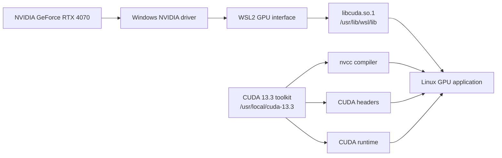

# Requirements

### Functional requirements:

* Use the NVIDIA GeForce RTX 4070 from the Ubuntu WSL2 development environment.
* Provide `nvidia-smi` for checking the GPU, driver and available memory.
* Provide `nvcc` and the CUDA headers for compiling CUDA C++ kernels.
* Allow Rust code to launch CUDA kernels and exchange particle data with GPU memory.
* Support a GPU-accelerated particle simulation with a reproducible CPU-to-GPU build process.
* Work from Cargo so the Rust application and CUDA C++ code can be built together.
* Support development through VS Code without false missing-header diagnostics.

### Toolchain requirements:

* Make the active CUDA installation discoverable through `/usr/local/cuda` and `CUDA_HOME`.
* Use the NVIDIA Windows driver exposed to WSL2 rather than installing a second Linux display driver inside Ubuntu.
* Link the Rust executable against the CUDA runtime and the C++ standard library.

# Initial design:

### Stage 0: inspect the existting WSL2 NVIDIA toolchain

The first stage checked each layer already avaliable inside Ubuntu. My PC was running WSL2 and exposed the NVIDIA GeForce RTX 4070 to WSL2 instance. The CUDA 13.3 toolit was installed under `/usr/local/cuda-13.3`, with the active CUDA path avaliable as `/usr/local/cuda`.



The validation found:

```text
GPU:             NVIDIA GeForce RTX 4070
GPU memory:      12282 MiB
NVIDIA-SMI:      610.43.02
Windows KMD:     610.62
CUDA UMD:        13.3
CUDA toolkit:    13.3
nvcc:            V13.3.73
```

### Problems and fixes:

| Problem | Symptom | Cause | Fix | Outcome |
|   ---   |   ---   |  ---  | --- |   ---   |
| Unclear whether CUDA was avaliable inside WSL2 | Ability to `see` the GPU within windows did not prove that Linux applications could use it | The driver, WSL GPU interface, toolkit and runtime are al seperate layers | Checed `nvidia-smi`, `nvcc`, CUDA library locations and the WSL2 kernel independently | Confirmed that the GPU, driver interface and compiler where all visible through Ubuntu |
| Multiple CUDA directories existed | CUDA libraries were present below both active toolkit paths | More than one toolkit version had been installed | Selected CUDA 13.3 through`/usr/local/cuda` and `CUDA_HOME=/usr/local/cuda-13.3`| The build used one deliberate toolkit version |

## Stage 1: verify CUDA with a small kernel

A small CUDA C++ program was used to verify the complete toolchain without involving the Rust project. The test checks that a CUDA device is available, allocates one integer on the GPU, runs a one-thread kernel which adds one, copies the result back to the CPU and checks that the result is `42`. *the meaning of life*

The test is stored in `docs/project/infastructure/cudatest.cu`:

```cuda
#include <cuda_runtime.h>

#include <cstdio>

__global__ void add_one(int *value) {
    *value += 1;
}

int main() {
    int device_count = 0;
    cudaError_t error = cudaGetDeviceCount(&device_count);

    if (error != cudaSuccess || device_count == 0) {
        std::fprintf(stderr, "CUDA device check failed: %s\n",
                     cudaGetErrorString(error));
        return 1;
    }

    int host_value = 41;
    int *device_value = nullptr;

    if (cudaMalloc(&device_value, sizeof(host_value)) != cudaSuccess ||
        cudaMemcpy(device_value, &host_value, sizeof(host_value),
                   cudaMemcpyHostToDevice) != cudaSuccess) {
        std::fprintf(stderr, "CUDA memory setup failed\n");
        cudaFree(device_value);
        return 1;
    }

    add_one<<<1, 1>>>(device_value);
    error = cudaDeviceSynchronize();

    if (error != cudaSuccess ||
        cudaMemcpy(&host_value, device_value, sizeof(host_value),
                   cudaMemcpyDeviceToHost) != cudaSuccess) {
        std::fprintf(stderr, "CUDA kernel failed: %s\n",
                     cudaGetErrorString(error));
        cudaFree(device_value);
        return 1;
    }

    cudaFree(device_value);
    std::printf("CUDA works: 41 + 1 = %d (%d device found)\n", host_value,
                device_count);

    return host_value == 42 ? 0 : 1;
}
```

It can be compiled and run from the repository root with:

```bash
nvcc docs/project/infastructure/cudatest.cu -o /tmp/cudatest
/tmp/cudatest
```

Success prints:

```text
CUDA works: 41 + 1 = 42 (1 device found)
```

This verifies that `nvcc`, `cuda_runtime.h`, the CUDA runtime, WSL2 GPU access, GPU memory transfers and CUDA kernel execution all work together.

*amazing*

# Evaluation

### What worked well:

- CUDA toolchain was already installed from past projects.
- Simple test passed.

### Weaknesses:

- Have not yet tested extensively the reliability, but as `nvcc` works, and simple test passed, this usually means the toolchain is working for all cases.

# Conclusion:

Easy setup, adn should be working for the main builds.

Final implementation meets the requirements.