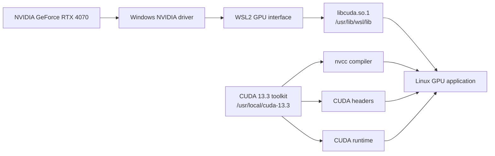

# Requirements

### Functional requirements:

* Use the [NVIDIA GeForce RTX 4070](https://en.wikipedia.org/wiki/GeForce_40_series) from the [Ubuntu](https://en.wikipedia.org/wiki/Ubuntu) [WSL2](https://en.wikipedia.org/wiki/Windows_Subsystem_for_Linux)<sup>[<a href="/docs/research/sources/019-microsoft-what-is-wsl.md">S019</a>]</sup> development environment.
* Provide [`nvidia-smi`](https://developer.nvidia.com/system-management-interface)<sup>[<a href="/docs/research/sources/044-nvidia-smi.md">S044</a>]</sup> for checking the [GPU](https://en.wikipedia.org/wiki/Graphics_processing_unit), [driver](https://en.wikipedia.org/wiki/Device_driver) and available [memory](https://en.wikipedia.org/wiki/Computer_memory).
* Provide [`nvcc`](https://docs.nvidia.com/cuda/cuda-compiler-driver-nvcc/)<sup>[<a href="/docs/research/sources/045-nvidia-nvcc.md">S045</a>]</sup> and the [CUDA](https://en.wikipedia.org/wiki/CUDA)<sup>[<a href="/docs/research/sources/012-nvidia-cuda-programming-guide-release-13-2.md">S012</a>]</sup> [headers](https://en.wikipedia.org/wiki/Include_directive) for compiling [CUDA C++](https://docs.nvidia.com/cuda/cuda-c-programming-guide/) [kernels](https://en.wikipedia.org/wiki/Compute_kernel).
* Allow [Rust](https://en.wikipedia.org/wiki/Rust_(programming_language)) code to launch [CUDA](https://en.wikipedia.org/wiki/CUDA) [kernels](https://en.wikipedia.org/wiki/Compute_kernel) and exchange [particle data](https://en.wikipedia.org/wiki/Particle_system) with [GPU memory](https://en.wikipedia.org/wiki/Graphics_processing_unit#GPU_memory).
* Support a [GPU-accelerated](https://en.wikipedia.org/wiki/General-purpose_computing_on_graphics_processing_units) [particle simulation](https://en.wikipedia.org/wiki/Particle_system)<sup>[<a href="/docs/research/sources/013-macklin-muller-chentanez-kim-unified-particle-physics.md">S013</a>]</sup> with a reproducible [CPU](https://en.wikipedia.org/wiki/Central_processing_unit)-to-[GPU](https://en.wikipedia.org/wiki/Graphics_processing_unit) build process.
* Work from [Cargo](https://doc.rust-lang.org/cargo/)<sup>[<a href="/docs/research/sources/046-rust-cargo-build-scripts.md">S046</a>]</sup> so the [Rust](https://en.wikipedia.org/wiki/Rust_(programming_language)) application and [CUDA C++](https://docs.nvidia.com/cuda/cuda-c-programming-guide/) code can be built together.
* Support development through [VS Code](https://en.wikipedia.org/wiki/Visual_Studio_Code)<sup>[<a href="/docs/research/sources/047-microsoft-vscode-cpp-intellisense.md">S047</a>]</sup> without false missing-[header](https://en.wikipedia.org/wiki/Include_directive) diagnostics.

### Toolchain requirements:

* Make the active [CUDA](https://en.wikipedia.org/wiki/CUDA) installation discoverable through [`/usr/local/cuda`](https://docs.nvidia.com/cuda/cuda-installation-guide-linux/)<sup>[<a href="/docs/research/sources/048-nvidia-cuda-linux-installation.md">S048</a>]</sup> and [`CUDA_HOME`](https://en.wikipedia.org/wiki/Environment_variable).
* Use the [NVIDIA](https://en.wikipedia.org/wiki/Nvidia) [Windows](https://en.wikipedia.org/wiki/Microsoft_Windows) [driver](https://en.wikipedia.org/wiki/Device_driver) exposed to [WSL2](https://en.wikipedia.org/wiki/Windows_Subsystem_for_Linux)<sup>[<a href="/docs/research/sources/043-nvidia-cuda-on-wsl.md">S043</a>]</sup> rather than installing a second [Linux](https://en.wikipedia.org/wiki/Linux) [display driver](https://en.wikipedia.org/wiki/Device_driver) inside [Ubuntu](https://en.wikipedia.org/wiki/Ubuntu)<sup>[<a href="/docs/research/sources/020-canonical-ubuntu-on-wsl.md">S020</a>]</sup>.
* Link the [Rust](https://en.wikipedia.org/wiki/Rust_(programming_language)) [executable](https://en.wikipedia.org/wiki/Executable) against the [CUDA runtime](https://docs.nvidia.com/cuda/cuda-runtime-api/)<sup>[<a href="/docs/research/sources/049-nvidia-cuda-runtime-api.md">S049</a>]</sup> and the [C++ standard library](https://en.wikipedia.org/wiki/C%2B%2B_Standard_Library).

# Initial design:

### Stage 0: inspect the existting [WSL2](https://en.wikipedia.org/wiki/Windows_Subsystem_for_Linux) [NVIDIA](https://en.wikipedia.org/wiki/Nvidia) [toolchain](https://en.wikipedia.org/wiki/Toolchain)

The first stage checked each layer already avaliable inside [Ubuntu](https://en.wikipedia.org/wiki/Ubuntu). My PC was running [WSL2](https://en.wikipedia.org/wiki/Windows_Subsystem_for_Linux) and exposed the [NVIDIA GeForce RTX 4070](https://en.wikipedia.org/wiki/GeForce_40_series) to [WSL2](https://en.wikipedia.org/wiki/Windows_Subsystem_for_Linux) instance. The [CUDA 13.3](https://docs.nvidia.com/cuda/) toolit was installed under [`/usr/local/cuda-13.3`](https://docs.nvidia.com/cuda/cuda-installation-guide-linux/), with the active [CUDA](https://en.wikipedia.org/wiki/CUDA) path avaliable as [`/usr/local/cuda`](https://docs.nvidia.com/cuda/cuda-installation-guide-linux/).



The validation found:

```text
GPU:             NVIDIA GeForce RTX 4070
GPU memory:      12282 MiB
NVIDIA-SMI:      610.43.02
Windows KMD:     610.62
CUDA UMD:        13.3
CUDA toolkit:    13.3
nvcc:            V13.3.73
```

### Problems and fixes:

| Problem | Symptom | Cause | Fix | Outcome |
|   ---   |   ---   |  ---  | --- |   ---   |
| Unclear whether [CUDA](https://en.wikipedia.org/wiki/CUDA) was avaliable inside [WSL2](https://en.wikipedia.org/wiki/Windows_Subsystem_for_Linux) | Ability to `see` the [GPU](https://en.wikipedia.org/wiki/Graphics_processing_unit) within [windows](https://en.wikipedia.org/wiki/Microsoft_Windows) did not prove that [Linux](https://en.wikipedia.org/wiki/Linux) applications could use it | The [driver](https://en.wikipedia.org/wiki/Device_driver), [WSL](https://en.wikipedia.org/wiki/Windows_Subsystem_for_Linux) [GPU interface](https://en.wikipedia.org/wiki/Interface_(computing)), [toolkit](https://en.wikipedia.org/wiki/Software_development_kit) and [runtime](https://en.wikipedia.org/wiki/Runtime_system) are al seperate layers | Checed [`nvidia-smi`](https://developer.nvidia.com/system-management-interface), [`nvcc`](https://docs.nvidia.com/cuda/cuda-compiler-driver-nvcc/), [CUDA library](https://docs.nvidia.com/cuda/cuda-runtime-api/) locations and the [WSL2 kernel](https://en.wikipedia.org/wiki/Windows_Subsystem_for_Linux) independently | Confirmed that the [GPU](https://en.wikipedia.org/wiki/Graphics_processing_unit), [driver interface](https://en.wikipedia.org/wiki/Device_driver) and [compiler](https://en.wikipedia.org/wiki/Compiler) where all visible through [Ubuntu](https://en.wikipedia.org/wiki/Ubuntu) |
| Multiple [CUDA](https://en.wikipedia.org/wiki/CUDA) directories existed | [CUDA libraries](https://docs.nvidia.com/cuda/cuda-runtime-api/) were present below both active [toolkit](https://en.wikipedia.org/wiki/Software_development_kit) paths | More than one [toolkit](https://en.wikipedia.org/wiki/Software_development_kit) version had been installed | Selected [CUDA 13.3](https://docs.nvidia.com/cuda/) through[`/usr/local/cuda`](https://docs.nvidia.com/cuda/cuda-installation-guide-linux/) and [`CUDA_HOME=/usr/local/cuda-13.3`](https://en.wikipedia.org/wiki/Environment_variable)| The build used one deliberate [toolkit](https://en.wikipedia.org/wiki/Software_development_kit) version |

## Stage 1: verify [CUDA](https://en.wikipedia.org/wiki/CUDA) with a small [kernel](https://en.wikipedia.org/wiki/Compute_kernel)

A small [CUDA C++](https://docs.nvidia.com/cuda/cuda-c-programming-guide/) program was used to verify the complete [toolchain](https://en.wikipedia.org/wiki/Toolchain) without involving the [Rust](https://en.wikipedia.org/wiki/Rust_(programming_language)) project. The test checks that a [CUDA device](https://en.wikipedia.org/wiki/CUDA) is available, allocates one integer on the [GPU](https://en.wikipedia.org/wiki/Graphics_processing_unit), runs a one-thread [kernel](https://en.wikipedia.org/wiki/Compute_kernel) which adds one, copies the result back to the [CPU](https://en.wikipedia.org/wiki/Central_processing_unit) and checks that the result is `42`. *the meaning of life*

The test is stored in [`docs/project/infastructure/cudatest.cu`](/docs/project/infastructure/CUDA/cudatest.cu):

```cuda
#include <cuda_runtime.h>

#include <cstdio>

__global__ void add_one(int *value) {
    *value += 1;
}

int main() {
    int device_count = 0;
    cudaError_t error = cudaGetDeviceCount(&device_count);

    if (error != cudaSuccess || device_count == 0) {
        std::fprintf(stderr, "CUDA device check failed: %s\n",
                     cudaGetErrorString(error));
        return 1;
    }

    int host_value = 41;
    int *device_value = nullptr;

    if (cudaMalloc(&device_value, sizeof(host_value)) != cudaSuccess ||
        cudaMemcpy(device_value, &host_value, sizeof(host_value),
                   cudaMemcpyHostToDevice) != cudaSuccess) {
        std::fprintf(stderr, "CUDA memory setup failed\n");
        cudaFree(device_value);
        return 1;
    }

    add_one<<<1, 1>>>(device_value);
    error = cudaDeviceSynchronize();

    if (error != cudaSuccess ||
        cudaMemcpy(&host_value, device_value, sizeof(host_value),
                   cudaMemcpyDeviceToHost) != cudaSuccess) {
        std::fprintf(stderr, "CUDA kernel failed: %s\n",
                     cudaGetErrorString(error));
        cudaFree(device_value);
        return 1;
    }

    cudaFree(device_value);
    std::printf("CUDA works: 41 + 1 = %d (%d device found)\n", host_value,
                device_count);

    return host_value == 42 ? 0 : 1;
}
```

It can be compiled and run from the repository root with:

```bash
nvcc docs/project/infastructure/cudatest.cu -o /tmp/cudatest
/tmp/cudatest
```

Success prints:

```text
CUDA works: 41 + 1 = 42 (1 device found)
```

This verifies that [`nvcc`](https://docs.nvidia.com/cuda/cuda-compiler-driver-nvcc/), [`cuda_runtime.h`](https://docs.nvidia.com/cuda/cuda-runtime-api/), the [CUDA runtime](https://docs.nvidia.com/cuda/cuda-runtime-api/), [WSL2](https://en.wikipedia.org/wiki/Windows_Subsystem_for_Linux) [GPU](https://en.wikipedia.org/wiki/Graphics_processing_unit) access, [GPU memory transfers](https://docs.nvidia.com/cuda/cuda-runtime-api/group__CUDART__MEMORY.html) and [CUDA kernel](https://en.wikipedia.org/wiki/Compute_kernel) execution all work together.

*amazing*

# Evaluation

### What worked well:

- [CUDA](https://en.wikipedia.org/wiki/CUDA) [toolchain](https://en.wikipedia.org/wiki/Toolchain) was already installed from past projects.
- Simple test passed.

### Weaknesses:

- Have not yet tested extensively the reliability, but as [`nvcc`](https://docs.nvidia.com/cuda/cuda-compiler-driver-nvcc/) works, and simple test passed, this usually means the [toolchain](https://en.wikipedia.org/wiki/Toolchain) is working for all cases.

# Conclusion:

Easy setup, adn should be working for the main builds.

Final implementation meets the requirements.
