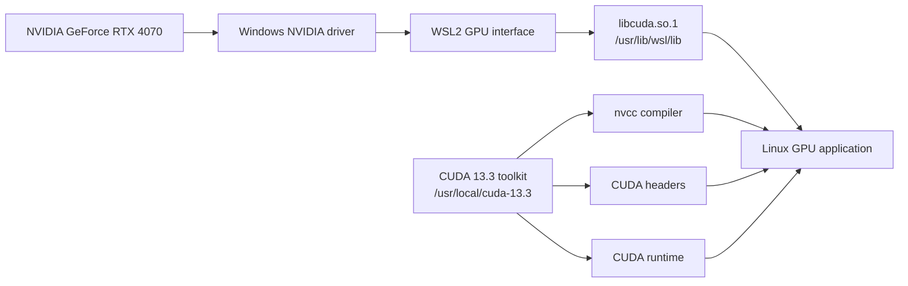

# Requirements

### Functional requirements:

* Use the [NVIDIA GeForce RTX 4070](https://en.wikipedia.org/wiki/GeForce_40_series) from the [Ubuntu](https://en.wikipedia.org/wiki/Ubuntu) [WSL2](https://en.wikipedia.org/wiki/Windows_Subsystem_for_Linux) development environment.<sup><a href="#ref-s019">S019</a>, <a href="#ref-s020">S020</a></sup>
* Provide [`nvidia-smi`](https://developer.nvidia.com/system-management-interface) for checking the [GPU](https://en.wikipedia.org/wiki/Graphics_processing_unit), [driver](https://en.wikipedia.org/wiki/Device_driver) and available [memory](https://en.wikipedia.org/wiki/Computer_memory).<sup><a href="#ref-s044">S044</a></sup>
* Provide [`nvcc`](https://docs.nvidia.com/cuda/cuda-compiler-driver-nvcc/) and the [CUDA](https://en.wikipedia.org/wiki/CUDA) [headers](https://en.wikipedia.org/wiki/Include_directive) for compiling [CUDA C++](https://docs.nvidia.com/cuda/cuda-c-programming-guide/) [kernels](https://en.wikipedia.org/wiki/Compute_kernel).<sup><a href="#ref-s012">S012</a>, <a href="#ref-s045">S045</a></sup>
* Allow [Rust](https://en.wikipedia.org/wiki/Rust_(programming_language)) code to launch CUDA kernels and exchange [particle data](https://en.wikipedia.org/wiki/Particle_system) with GPU memory.<sup><a href="#ref-s012">S012</a>, <a href="#ref-s049">S049</a></sup>
* Support a [GPU-accelerated](https://en.wikipedia.org/wiki/General-purpose_computing_on_graphics_processing_units) particle simulation with a reproducible [CPU](https://en.wikipedia.org/wiki/Central_processing_unit)-to-GPU build process.<sup><a href="#ref-s012">S012</a>, <a href="#ref-s013">S013</a></sup>
* Work from [Cargo](https://doc.rust-lang.org/cargo/) so the Rust application and CUDA C++ code can be built together.<sup><a href="#ref-s046">S046</a></sup>
* Support development through [VS Code](https://en.wikipedia.org/wiki/Visual_Studio_Code) without false missing-header diagnostics.<sup><a href="#ref-s047">S047</a></sup>

### Toolchain requirements:

* Make the active CUDA installation discoverable through [`/usr/local/cuda`](https://docs.nvidia.com/cuda/cuda-installation-guide-linux/) and [`CUDA_HOME`](https://en.wikipedia.org/wiki/Environment_variable).<sup><a href="#ref-s048">S048</a></sup>
* Use the [NVIDIA](https://en.wikipedia.org/wiki/Nvidia) [Windows](https://en.wikipedia.org/wiki/Microsoft_Windows) driver exposed to WSL2 rather than installing a second [Linux](https://en.wikipedia.org/wiki/Linux) display driver inside Ubuntu.<sup><a href="#ref-s043">S043</a></sup>
* Link the Rust [executable](https://en.wikipedia.org/wiki/Executable) against the [CUDA runtime](https://docs.nvidia.com/cuda/cuda-runtime-api/) and the [C++ standard library](https://en.wikipedia.org/wiki/C%2B%2B_Standard_Library).<sup><a href="#ref-s049">S049</a></sup>

# Initial design:

### Stage 0: inspect the existting WSL2 NVIDIA [toolchain](https://en.wikipedia.org/wiki/Toolchain)

The first stage checked each layer already avaliable inside Ubuntu. My PC was running WSL2 and exposed the NVIDIA GeForce RTX 4070 to WSL2 instance. The CUDA 13.3 toolit was installed under `/usr/local/cuda-13.3`, with the active CUDA path avaliable as `/usr/local/cuda`.


```mermaid
flowchart LR
    GPU[NVIDIA GeForce RTX 4070] --> WD[Windows NVIDIA driver]
    WD --> WSL[WSL2 GPU interface]
    WSL --> DC[libcuda.so.1<br/>/usr/lib/wsl/lib]
    CT[CUDA 13.3 toolkit<br/>/usr/local/cuda-13.3] --> NVCC[nvcc compiler]
    CT --> HDR[CUDA headers]
    CT --> RT[CUDA runtime]
    DC --> APP[Linux GPU application]
    NVCC --> APP
    HDR --> APP
    RT --> APP
```

The validation found:

```text
GPU:             NVIDIA GeForce RTX 4070
GPU memory:      12282 MiB
NVIDIA-SMI:      610.43.02
Windows KMD:     610.62
CUDA UMD:        13.3
CUDA toolkit:    13.3
nvcc:            V13.3.73
```

### Problems and fixes:

| Problem | Symptom | Cause | Fix | Outcome |
|   ---   |   ---   |  ---  | --- |   ---   |
| Unclear whether CUDA was avaliable inside WSL2 | Ability to `see` the GPU within windows did not prove that Linux applications could use it | The driver, WSL [GPU interface](https://en.wikipedia.org/wiki/Interface_(computing)), [toolkit](https://en.wikipedia.org/wiki/Software_development_kit) and [runtime](https://en.wikipedia.org/wiki/Runtime_system) are al seperate layers.<sup><a href="#ref-s043">S043</a></sup> | Checed `nvidia-smi`, `nvcc`, CUDA library locations and the WSL2 kernel independently.<sup><a href="#ref-s044">S044</a>, <a href="#ref-s045">S045</a>, <a href="#ref-s049">S049</a></sup> | Confirmed that the GPU, driver interface and [compiler](https://en.wikipedia.org/wiki/Compiler) where all visible through Ubuntu |
| Multiple CUDA directories existed | CUDA libraries were present below both active toolkit paths | More than one toolkit version had been installed | Selected CUDA 13.3 through `/usr/local/cuda` and `CUDA_HOME=/usr/local/cuda-13.3`.<sup><a href="#ref-s048">S048</a></sup> | The build used one deliberate toolkit version |

## Stage 1: verify CUDA with a small kernel

A small CUDA C++ program was used to verify the complete toolchain without involving the Rust project. The test checks that a CUDA device is available, allocates one integer on the GPU, runs a one-thread kernel which adds one, copies the result back to the CPU and checks that the result is `42`.<sup><a href="#ref-s049">S049</a></sup> *the meaning of life*

The test is stored in [`docs/project/infastructure/cudatest.cu`](/docs/project/infastructure/CUDA/cudatest.cu):

```cuda
#include <cuda_runtime.h>

#include <cstdio>

__global__ void add_one(int *value) {
    *value += 1;
}

int main() {
    int device_count = 0;
    cudaError_t error = cudaGetDeviceCount(&device_count);

    if (error != cudaSuccess || device_count == 0) {
        std::fprintf(stderr, "CUDA device check failed: %s\n",
                     cudaGetErrorString(error));
        return 1;
    }

    int host_value = 41;
    int *device_value = nullptr;

    if (cudaMalloc(&device_value, sizeof(host_value)) != cudaSuccess ||
        cudaMemcpy(device_value, &host_value, sizeof(host_value),
                   cudaMemcpyHostToDevice) != cudaSuccess) {
        std::fprintf(stderr, "CUDA memory setup failed\n");
        cudaFree(device_value);
        return 1;
    }

    add_one<<<1, 1>>>(device_value);
    error = cudaDeviceSynchronize();

    if (error != cudaSuccess ||
        cudaMemcpy(&host_value, device_value, sizeof(host_value),
                   cudaMemcpyDeviceToHost) != cudaSuccess) {
        std::fprintf(stderr, "CUDA kernel failed: %s\n",
                     cudaGetErrorString(error));
        cudaFree(device_value);
        return 1;
    }

    cudaFree(device_value);
    std::printf("CUDA works: 41 + 1 = %d (%d device found)\n", host_value,
                device_count);

    return host_value == 42 ? 0 : 1;
}
```

It can be compiled and run from the repository root with:

```bash
nvcc docs/project/infastructure/cudatest.cu -o /tmp/cudatest
/tmp/cudatest
```

Success prints:

```text
CUDA works: 41 + 1 = 42 (1 device found)
```

This verifies that `nvcc`, `cuda_runtime.h`, the CUDA runtime, WSL2 GPU access, GPU memory transfers and CUDA kernel execution all work together.

*amazing*

# Evaluation

### What worked well:

- CUDA toolchain was already installed from past projects.
- Simple test passed.

### Weaknesses:

- Have not yet tested extensively the reliability, but as `nvcc` works, and simple test passed, this usually means the toolchain is working for all cases.

# Conclusion:

Easy setup, adn should be working for the main builds.

Final implementation meets the requirements.

## References used

- <a name="ref-s012"></a> **S012 — NVIDIA Corporation (2026).** *CUDA Programming Guide*, Release 13.2. [Source record](/docs/research/sources/012-nvidia-cuda-programming-guide-release-13-2.md).
- <a name="ref-s013"></a> **S013 — Macklin et al. (2014).** ‘Unified Particle Physics for Real-Time Applications’. [Source record](/docs/research/sources/013-macklin-muller-chentanez-kim-unified-particle-physics.md).
- <a name="ref-s019"></a> **S019 — Microsoft (2025).** ‘What is the Windows Subsystem for Linux?’. [Source record](/docs/research/sources/019-microsoft-what-is-wsl.md).
- <a name="ref-s020"></a> **S020 — Canonical Ltd. (2026).** ‘Ubuntu on WSL’. [Source record](/docs/research/sources/020-canonical-ubuntu-on-wsl.md).
- <a name="ref-s043"></a> **S043 — NVIDIA (2026).** *CUDA on WSL User Guide*, Version 13.3. [Source record](/docs/research/sources/043-nvidia-cuda-on-wsl.md).
- <a name="ref-s044"></a> **S044 — NVIDIA (2026).** ‘nvidia-smi’. [Source record](/docs/research/sources/044-nvidia-smi.md).
- <a name="ref-s045"></a> **S045 — NVIDIA (2026).** *NVIDIA CUDA Compiler Driver NVCC*, Version 13.3. [Source record](/docs/research/sources/045-nvidia-nvcc.md).
- <a name="ref-s046"></a> **S046 — Rust Project Developers (n.d.).** ‘Build Scripts’. [Source record](/docs/research/sources/046-rust-cargo-build-scripts.md).
- <a name="ref-s047"></a> **S047 — Microsoft (n.d.).** ‘Configure C/C++ IntelliSense’. [Source record](/docs/research/sources/047-microsoft-vscode-cpp-intellisense.md).
- <a name="ref-s048"></a> **S048 — NVIDIA (2026).** *CUDA Installation Guide for Linux*, Version 13.3. [Source record](/docs/research/sources/048-nvidia-cuda-linux-installation.md).
- <a name="ref-s049"></a> **S049 — NVIDIA (2026).** *CUDA Runtime API*, Version 13.3.1. [Source record](/docs/research/sources/049-nvidia-cuda-runtime-api.md).
