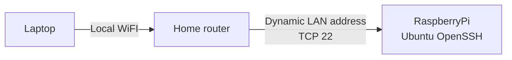
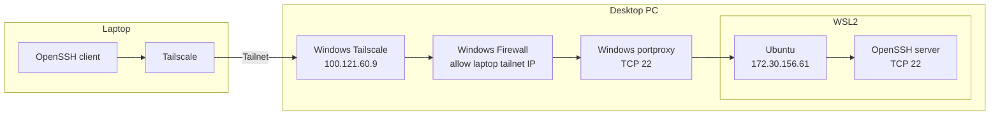
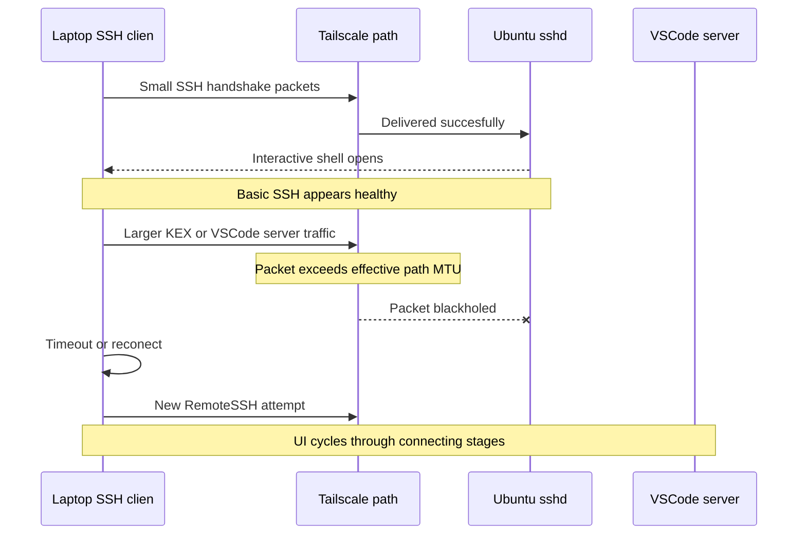
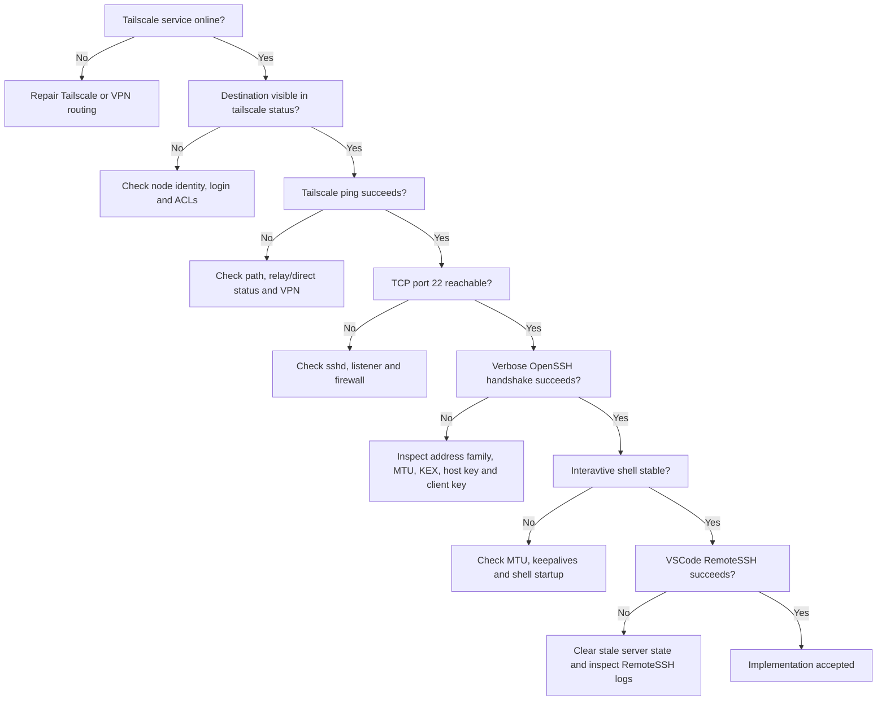
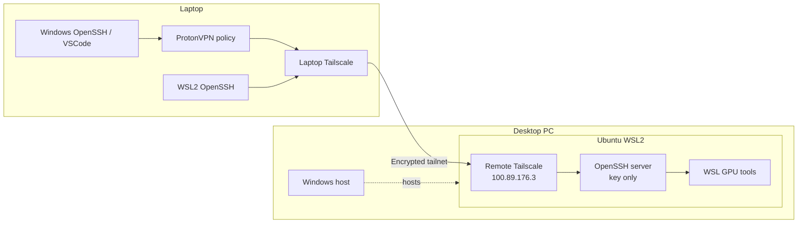
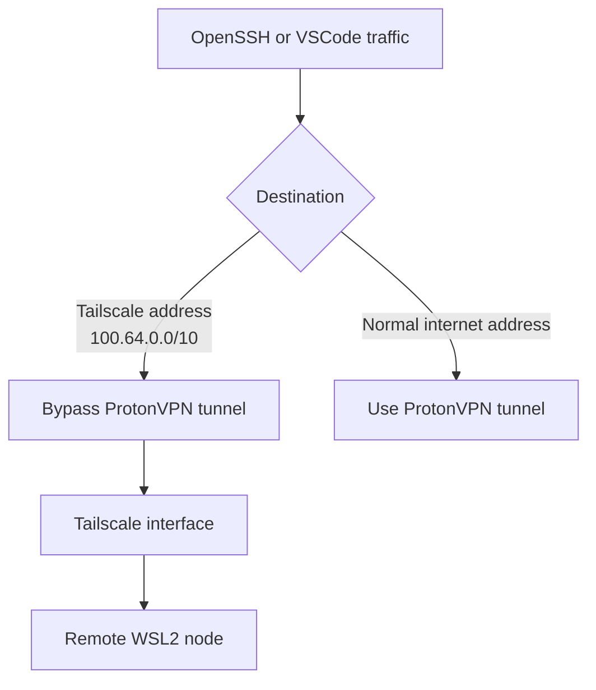
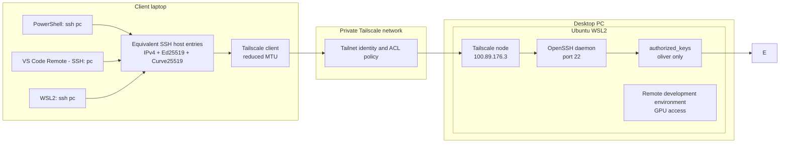
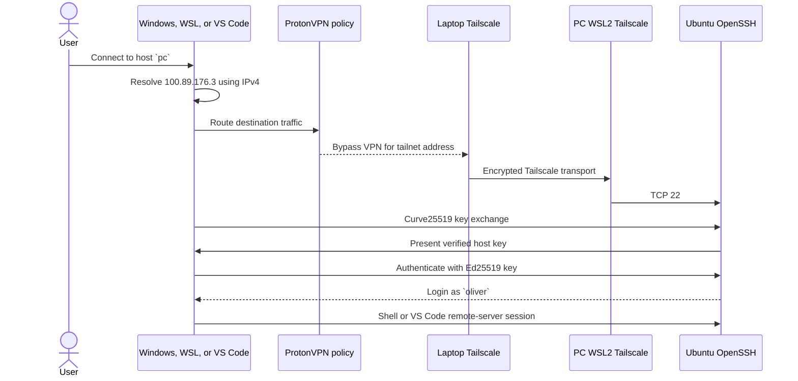

# Requirements

### Functional requirements: 
 * Allow for out of home [network](https://en.wikipedia.org/wiki/Computer_network)<sup>[<a href="/docs/research/sources/021-cloudflare-what-is-a-lan.md">S021</a>]</sup> communication between *more powerfull* home computer, and laptop, which i use for most development. 
 * Should be simple to connect, secure, fast, and avaliable from any [network](https://en.wikipedia.org/wiki/Computer_network).
 * Connect from laptop to desktop with "[ssh](https://en.wikipedia.org/wiki/Secure_Shell)<sup>[<a href="/docs/research/sources/017-cloudflare-what-is-ssh.md">S017</a>]</sup> pc"
 * Supporrt connections from both [Windows](https://en.wikipedia.org/wiki/Microsoft_Windows)<sup>[<a href="/docs/research/sources/031-microsoft-windows-documentation.md">S031</a>]</sup> [PowerShell](https://learn.microsoft.com/en-us/powershell/)<sup>[<a href="/docs/research/sources/026-microsoft-what-is-powershell.md">S026</a>]</sup> and [WSL2](https://en.wikipedia.org/wiki/Windows_Subsystem_for_Linux)<sup>[<a href="/docs/research/sources/019-microsoft-what-is-wsl.md">S019</a>]</sup> [Ubuntu](https://en.wikipedia.org/wiki/Ubuntu)<sup>[<a href="/docs/research/sources/020-canonical-ubuntu-on-wsl.md">S020</a>]</sup> instance.
 * Support [VSCode](https://en.wikipedia.org/wiki/Visual_Studio_Code)<sup>[<a href="/docs/research/sources/025-microsoft-vscode-remote-ssh.md">S025</a>]</sup> [Remote-SSH](https://code.visualstudio.com/docs/remote/ssh) useing the same `pc` alias.
 * Connect to the [Ubuntu](https://en.wikipedia.org/wiki/Ubuntu)  [WSL2](https://en.wikipedia.org/wiki/Windows_Subsystem_for_Linux) environment on the pc, nto the outer [Windows](https://en.wikipedia.org/wiki/Microsoft_Windows) [OpenSSH](https://en.wikipedia.org/wiki/OpenSSH)<sup>[<a href="/docs/research/sources/018-openbsd-openssh.md">S018</a>]</sup> server.
 * Be suitable for development of performance intensive applications.
 * Be able to work away from home.

### Security requirements:
 * Use [publickey authentification](https://en.wikipedia.org/wiki/Public-key_cryptography)<sup>[<a href="/docs/research/sources/028-openbsd-sshd-config.md">S028</a>]</sup>.
 * Disable [SSH](https://en.wikipedia.org/wiki/Secure_Shell) [password authentification](https://en.wikipedia.org/wiki/Authentication). ( as to reject [brute force](https://en.wikipedia.org/wiki/Brute-force_attack)<sup>[<a href="/docs/research/sources/030-cloudflare-brute-force-attacks.md">S030</a>]</sup> on open [port22](https://en.wikipedia.org/wiki/Port_(computer_networking))<sup>[<a href="/docs/research/sources/022-cloudflare-computer-ports.md">S022</a>]</sup> )
 * Do not expose [port 22](https://en.wikipedia.org/wiki/Port_(computer_networking)) through the [router](https://en.wikipedia.org/wiki/Router_(computing)).

# Initial design:

## Stage 0: Local [network](https://en.wikipedia.org/wiki/Computer_network) test [SSH](https://en.wikipedia.org/wiki/Secure_Shell) to [RaspberryPI](https://en.wikipedia.org/wiki/Raspberry_Pi)<sup>[<a href="/docs/research/sources/027-raspberry-pi-about.md">S027</a>]</sup>

First [SSH](https://en.wikipedia.org/wiki/Secure_Shell) workflow targeted a [RaspberryPi](https://en.wikipedia.org/wiki/Raspberry_Pi) by its own [local area network (LAN)](https://en.wikipedia.org/wiki/Local_area_network) [address](https://en.wikipedia.org/wiki/IP_address)<sup>[<a href="/docs/research/sources/029-cloudflare-ip-addresses.md">S029</a>]</sup>. [Command line](https://en.wikipedia.org/wiki/Command-line_interface) [SSH](https://en.wikipedia.org/wiki/Secure_Shell) worked, but the [Pi](https://en.wikipedia.org/wiki/Raspberry_Pi)'s [address](https://en.wikipedia.org/wiki/IP_address) later changed after [netowrk](https://en.wikipedia.org/wiki/Computer_network) changes, and [VSCode](https://en.wikipedia.org/wiki/Visual_Studio_Code) did not consistently interpret the [Windows](https://en.wikipedia.org/wiki/Microsoft_Windows) [SSH configuration](https://en.wikipedia.org/wiki/Secure_Shell).


### Probelems and fixes:

*a lot*

| Problem | Symptom | Cause | Fix | Outcome |
|   ---   |   ---   |  ---  | --- |   ---   |
|[VSCode](https://en.wikipedia.org/wiki/Visual_Studio_Code) could not connect to the [Pi](https://en.wikipedia.org/wiki/Raspberry_Pi) although [shell](https://en.wikipedia.org/wiki/Shell_(computing)) [SSH](https://en.wikipedia.org/wiki/Secure_Shell) worked | [Remote-SSH](https://code.visualstudio.com/docs/remote/ssh) failed while `ssh mahkrab@192.168.0.58` succeeded | Inconsistent [WIndows](https://en.wikipedia.org/wiki/Microsoft_Windows) [SSH host entries](https://en.wikipedia.org/wiki/Secure_Shell) and [VSCode](https://en.wikipedia.org/wiki/Visual_Studio_Code) targets | Standardised named [host entries](https://en.wikipedia.org/wiki/Secure_Shell) and connected [VSCode](https://en.wikipedia.org/wiki/Visual_Studio_Code) to the alias, not to a pasted `ssh` command | Configuration became reusable by [VSCode](https://en.wikipedia.org/wiki/Visual_Studio_Code) |
| The [Pi](https://en.wikipedia.org/wiki/Raspberry_Pi) became unreachable by its previous [address](https://en.wikipedia.org/wiki/IP_address) | [SSH key](https://en.wikipedia.org/wiki/Key_(cryptography)) existed, but the other [LAN](https://en.wikipedia.org/wiki/Local_area_network) [IP](https://en.wikipedia.org/wiki/IP_address) no longer responded after [WiFi](https://en.wikipedia.org/wiki/Wi-Fi) maintence | [DHCP](https://en.wikipedia.org/wiki/Dynamic_Host_Configuration_Protocol)<sup>[<a href="/docs/research/sources/023-microsoft-dhcp-basics.md">S023</a>]</sup> changed the [Pi](https://en.wikipedia.org/wiki/Raspberry_Pi)'s [LAN](https://en.wikipedia.org/wiki/Local_area_network) [address](https://en.wikipedia.org/wiki/IP_address) | Rediscovered [Pi](https://en.wikipedia.org/wiki/Raspberry_Pi) and moved towards stable named [SSH entries](https://en.wikipedia.org/wiki/Secure_Shell) | Showed thr weakness of raw [LAN](https://en.wikipedia.org/wiki/Local_area_network) [addresses](https://en.wikipedia.org/wiki/IP_address) |

This model and problems established two points:

1. A named [SSH host entry](https://en.wikipedia.org/wiki/Secure_Shell) is better than repeatadly entering an [address](https://en.wikipedia.org/wiki/IP_address) and username.
2. A dynamic [LAN](https://en.wikipedia.org/wiki/Local_area_network) [address](https://en.wikipedia.org/wiki/IP_address) is not a dependable identity. 

## Stage 1: [Windows](https://en.wikipedia.org/wiki/Microsoft_Windows) [Tailscale](https://en.wikipedia.org/wiki/Tailscale)<sup>[<a href="/docs/research/sources/016-tailscale-what-is-tailscale.md">S016</a>]</sup> with forwarding into [WSL2](https://en.wikipedia.org/wiki/Windows_Subsystem_for_Linux)

The first desktop --> PC design ran [Tailscale](https://en.wikipedia.org/wiki/Tailscale). [Windows](https://en.wikipedia.org/wiki/Microsoft_Windows) accepted traffic on its [Tailscale](https://en.wikipedia.org/wiki/Tailscale) [address](https://en.wikipedia.org/wiki/IP_address) and forwarded [TCP](https://en.wikipedia.org/wiki/Transmission_Control_Protocol) [port 22](https://en.wikipedia.org/wiki/Port_(computer_networking)) to the changing [WSL2](https://en.wikipedia.org/wiki/Windows_Subsystem_for_Linux) [NAT](https://en.wikipedia.org/wiki/Network_address_translation)<sup>[<a href="/docs/research/sources/024-microsoft-wsl-networking.md">S024</a>]</sup> [address](https://en.wikipedia.org/wiki/IP_address) using [`netsh interface portproxy`](https://learn.microsoft.com/en-us/windows-server/networking/technologies/netsh/netsh-interface-portproxy).


<details>
<summary><b>SSH Config on laptop for PC:</b></summary>

```sshconfig
Host pc
   HostName oliverpc.taillab589b.ts.net
   User oliver
   IdentityFile ~/.ssh/id_ed25519
   IdentitiesOnly yes
```
</details>

### Limitations of the initial design:

- [WSL2s](https://en.wikipedia.org/wiki/Windows_Subsystem_for_Linux) [NAT](https://en.wikipedia.org/wiki/Network_address_translation) [address](https://en.wikipedia.org/wiki/IP_address) could change after a restart.
- [`portproxy`](https://learn.microsoft.com/en-us/windows-server/networking/technologies/netsh/netsh-interface-portproxy) needed to be updated manuallly.
- [Windows](https://en.wikipedia.org/wiki/Microsoft_Windows) [Firewall](https://en.wikipedia.org/wiki/Firewall_(computing)), [Windows](https://en.wikipedia.org/wiki/Microsoft_Windows) [Tailscale](https://en.wikipedia.org/wiki/Tailscale), [`portproxy`](https://learn.microsoft.com/en-us/windows-server/networking/technologies/netsh/netsh-interface-portproxy), [WSL](https://en.wikipedia.org/wiki/Windows_Subsystem_for_Linux) [network](https://en.wikipedia.org/wiki/Computer_network), and [Ubuntu](https://en.wikipedia.org/wiki/Ubuntu) [SSH](https://en.wikipedia.org/wiki/Secure_Shell) all had to be healthy at one time, or whole system fail.
- Troubleshooting crossed two vastly different [operating systems](https://en.wikipedia.org/wiki/Operating_system) and several layers ( [Windows](https://en.wikipedia.org/wiki/Microsoft_Windows) -> [WSL2](https://en.wikipedia.org/wiki/Windows_Subsystem_for_Linux) )
- Both [Windows](https://en.wikipedia.org/wiki/Microsoft_Windows) and [WSL](https://en.wikipedia.org/wiki/Windows_Subsystem_for_Linux) could take different [network](https://en.wikipedia.org/wiki/Computer_network) paths despite using the same [SSH](https://en.wikipedia.org/wiki/Secure_Shell) command.

### Probelems and fixes:

*a lot more*

| Problem | Symptom | Cause | Fix | Outcome |
|   ---   |   ---   |  ---  | --- |   ---   |
| The PC design depended on [Windows](https://en.wikipedia.org/wiki/Microsoft_Windows) forwarding, which of course is unreliable | [WSL](https://en.wikipedia.org/wiki/Windows_Subsystem_for_Linux) [SSH](https://en.wikipedia.org/wiki/Secure_Shell) was reachable only through [Windows](https://en.wikipedia.org/wiki/Microsoft_Windows) [Tailscale](https://en.wikipedia.org/wiki/Tailscale), [Firewall](https://en.wikipedia.org/wiki/Firewall_(computing)), and [`portproxy`](https://learn.microsoft.com/en-us/windows-server/networking/technologies/netsh/netsh-interface-portproxy) | [Tailscale](https://en.wikipedia.org/wiki/Tailscale) was running on [windows](https://en.wikipedia.org/wiki/Microsoft_Windows) rather than inside the [Linux](https://en.wikipedia.org/wiki/Linux) environment | Installed and ran [Tailscale](https://en.wikipedia.org/wiki/Tailscale) directly in the PC's [Ubuntu](https://en.wikipedia.org/wiki/Ubuntu) [WSL2](https://en.wikipedia.org/wiki/Windows_Subsystem_for_Linux) instance | Removed the forwarding layer from the design |
| `ssh pc` selected an unusable destination | The [Tailscale](https://en.wikipedia.org/wiki/Tailscale) [dashboard](https://en.wikipedia.org/wiki/Dashboard_(computing)) showed the [node](https://en.wikipedia.org/wiki/Node_(networking)) online, but [SSH](https://en.wikipedia.org/wiki/Secure_Shell) attempted a [IPv6](https://en.wikipedia.org/wiki/IPv6) [address](https://en.wikipedia.org/wiki/IP_address) with no working [route](https://en.wikipedia.org/wiki/Routing) | [Address](https://en.wikipedia.org/wiki/IP_address) selection prefered an [IPv6](https://en.wikipedia.org/wiki/IPv6) path that was not usable end to end | Pointed `pc` directly to `100.89.176.3` and set [`AddressFamily inet`](https://man.openbsd.org/ssh_config#AddressFamily)<sup>[<a href="/docs/research/sources/033-openbsd-ssh-config.md">S033</a>]</sup> | [SSH](https://en.wikipedia.org/wiki/Secure_Shell) consistently selected the working [Tailscale](https://en.wikipedia.org/wiki/Tailscale) [IPv4](https://en.wikipedia.org/wiki/Internet_Protocol_version_4) [route](https://en.wikipedia.org/wiki/Routing) |
| [SSH](https://en.wikipedia.org/wiki/Secure_Shell) connected then hung | [WSL](https://en.wikipedia.org/wiki/Windows_Subsystem_for_Linux) [SSH](https://en.wikipedia.org/wiki/Secure_Shell) stalled during *[negotiation](https://en.wikipedia.org/wiki/Secure_Shell)*, especially at [`sntrup`](https://en.wikipedia.org/wiki/NTRU)<sup>[<a href="/docs/research/sources/034-openssh-release-notes.md">S034</a>]</sup> [key exchange](https://en.wikipedia.org/wiki/Key_exchange) | The larger [post-quantum](https://en.wikipedia.org/wiki/Post-quantum_cryptography) *fancy* [key exchange](https://en.wikipedia.org/wiki/Key_exchange) [packets](https://en.wikipedia.org/wiki/Network_packet) exposed an [MTU](https://en.wikipedia.org/wiki/Maximum_transmission_unit)<sup>[<a href="/docs/research/sources/032-rfc-2923-path-mtu-discovery.md">S032</a>]</sup> *[black hole](https://en.wikipedia.org/wiki/Path_MTU_Discovery)* through [WSL2](https://en.wikipedia.org/wiki/Windows_Subsystem_for_Linux) and [Tailscale](https://en.wikipedia.org/wiki/Tailscale) [encapsulation](https://en.wikipedia.org/wiki/Encapsulation_(networking))| Preffered [`curve25519-sha256`](https://en.wikipedia.org/wiki/Curve25519)<sup>[<a href="/docs/research/sources/040-rfc-8731-curve25519-ssh.md">S040</a>]</sup> and reduced the effective [tailscale](https://en.wikipedia.org/wiki/Tailscale) [MTU](https://en.wikipedia.org/wiki/Maximum_transmission_unit) | Interactive [SSH](https://en.wikipedia.org/wiki/Secure_Shell) became reliable *finally* |
| [VSCode](https://en.wikipedia.org/wiki/Visual_Studio_Code) repeatedly cycled through connection stages | Plain [SSH](https://en.wikipedia.org/wiki/Secure_Shell) worked, but [VSCode-RemoteSSH](https://code.visualstudio.com/docs/remote/ssh) repeatedly reconnected whule installing or starting its remote server | [VSCode](https://en.wikipedia.org/wiki/Visual_Studio_Code) transferred more and larger data than a basic [shell](https://en.wikipedia.org/wiki/Shell_(computing)), triggering the same [MTU](https://en.wikipedia.org/wiki/Maximum_transmission_unit) problem | CLeared out old [processes](https://en.wikipedia.org/wiki/Process_(computing)) which started when connecting, shrank the [handshake](https://en.wikipedia.org/wiki/Handshaking) size ([KEX](https://en.wikipedia.org/wiki/Key_exchange)), and forced [network](https://en.wikipedia.org/wiki/Computer_network) to only send smaller [packets](https://en.wikipedia.org/wiki/Network_packet) ([MTU](https://en.wikipedia.org/wiki/Maximum_transmission_unit)), then restarted the server | Removed the known causes of the connection loop |
| [Tailscale](https://en.wikipedia.org/wiki/Tailscale) failed on school [WiFI](https://en.wikipedia.org/wiki/Wi-Fi) while [VPN](https://en.wikipedia.org/wiki/Virtual_private_network) was active | [DNS](https://en.wikipedia.org/wiki/Domain_Name_System)<sup>[<a href="/docs/research/sources/038-cloudflare-what-is-dns.md">S038</a>]</sup> lookup failed for the [tailscale](https://en.wikipedia.org/wiki/Tailscale) control; anotjer attempt returnede an invalid [certificate](https://en.wikipedia.org/wiki/Public_key_certificate) response | [VPN](https://en.wikipedia.org/wiki/Virtual_private_network) or [network](https://en.wikipedia.org/wiki/Computer_network) interception effected [DNS](https://en.wikipedia.org/wiki/Domain_Name_System)/[TLS](https://en.wikipedia.org/wiki/Transport_Layer_Security)<sup>[<a href="/docs/research/sources/039-cloudflare-what-is-tls.md">S039</a>]</sup> traffic | Adjusted [VPN](https://en.wikipedia.org/wiki/Virtual_private_network) [routing](https://en.wikipedia.org/wiki/Routing) so [tailscale](https://en.wikipedia.org/wiki/Tailscale) traffic bypassed the bad path | Thinned out issues with School [Wi-Ff](https://en.wikipedia.org/wiki/Wi-Fi) |
| [Windows](https://en.wikipedia.org/wiki/Microsoft_Windows) [SSH](https://en.wikipedia.org/wiki/Secure_Shell) returned `Permission denied` while [WSL](https://en.wikipedia.org/wiki/Windows_Subsystem_for_Linux) [SSH](https://en.wikipedia.org/wiki/Secure_Shell) worked | The same [alias](https://en.wikipedia.org/wiki/Alias_(command)) and [key](https://en.wikipedia.org/wiki/Key_(cryptography)) worked in [WSL](https://en.wikipedia.org/wiki/Windows_Subsystem_for_Linux) but failed at the [windows](https://en.wikipedia.org/wiki/Microsoft_Windows) [socket](https://en.wikipedia.org/wiki/Network_socket) layer | [ProtonVPN](https://en.wikipedia.org/wiki/Proton_VPN)<sup>[<a href="/docs/research/sources/037-proton-vpn-split-tunneling.md">S037</a>]</sup> applied different filtering to [Windows](https://en.wikipedia.org/wiki/Microsoft_Windows) [OpenSSH](https://en.wikipedia.org/wiki/OpenSSH) and [WSL](https://en.wikipedia.org/wiki/Windows_Subsystem_for_Linux) traffic | Removed [OpenSSH](https://en.wikipedia.org/wiki/OpenSSH) and [VSCode](https://en.wikipedia.org/wiki/Visual_Studio_Code) application exclusions while keeping the [Tailscale](https://en.wikipedia.org/wiki/Tailscale) [network](https://en.wikipedia.org/wiki/Computer_network) exclusions | [Windows](https://en.wikipedia.org/wiki/Microsoft_Windows) `ssh pc` worked again on school [Wifi](https://en.wikipedia.org/wiki/Wi-Fi) |
| [ProtonVPN](https://en.wikipedia.org/wiki/Proton_VPN) [split-tunneling](https://en.wikipedia.org/wiki/Split_tunneling) changes caused [timeouts](https://en.wikipedia.org/wiki/Timeout_(computing)) | Combining application exclusions with [Tailscale](https://en.wikipedia.org/wiki/Tailscale) [address](https://en.wikipedia.org/wiki/IP_address) exclusions changed [routed](https://en.wikipedia.org/wiki/Routing) unpredictably | Two overlapping [split tunnel](https://en.wikipedia.org/wiki/Split_tunneling) policies competed for the same traffic | Kept one [routing](https://en.wikipedia.org/wiki/Routing) strategy: exclidingthe [Tailscale](https://en.wikipedia.org/wiki/Tailscale) [address space](https://en.wikipedia.org/wiki/Address_space), but do not seperately exclude [OpenSSH](https://en.wikipedia.org/wiki/OpenSSH) or [VSCode](https://en.wikipedia.org/wiki/Visual_Studio_Code) | [Windows](https://en.wikipedia.org/wiki/Microsoft_Windows) and [WSL](https://en.wikipedia.org/wiki/Windows_Subsystem_for_Linux) followed a more consistent path |
| [RemoteSSH](https://code.visualstudio.com/docs/remote/ssh) retained stale state after failed attempts | [VSCode](https://en.wikipedia.org/wiki/Visual_Studio_Code) continued cycling after [route](https://en.wikipedia.org/wiki/Routing) improved | Old local helper and remote [VSCode](https://en.wikipedia.org/wiki/Visual_Studio_Code) server [processes](https://en.wikipedia.org/wiki/Process_(computing)) survived different attempts | Again terminated old helpers and restarted the remote server installation/session | Clean connection state |

### Why basic SSH passed while VSCode failed:



## Testing and problems discovered:

### Layered diagnostic method:

Testing was deliberately performed from the lowest [network layer](https://en.wikipedia.org/wiki/Network_layer) upward. This prevents an [SSH](https://en.wikipedia.org/wiki/Secure_Shell) authentification problem from being comfused with [routing](https://en.wikipedia.org/wiki/Routing), [VPN](https://en.wikipedia.org/wiki/Virtual_private_network), or [transport](https://en.wikipedia.org/wiki/Transport_layer) problems. The method uses the Tailscale [`status`](https://tailscale.com/docs/reference/tailscale-cli#status) and [`ping`](https://tailscale.com/docs/reference/ping-types) commands<sup>[<a href="/docs/research/sources/036-tailscale-cli.md">S036</a>]</sup> and checks [access-control lists (ACLs)](https://en.wikipedia.org/wiki/Access-control_list)<sup>[<a href="/docs/research/sources/035-tailscale-acls.md">S035</a>]</sup> before testing SSH.



### Test matrix

| Test | Windows client | WSL2 client | Purpose | Important discovery |
|---|---:|---:|---|---|
| [`tailscale status`](https://tailscale.com/docs/reference/tailscale-cli#status) | Yes | Yes | Confirm local [node](https://en.wikipedia.org/wiki/Node_(networking)) and [peer](https://en.wikipedia.org/wiki/Peer-to-peer) visibility | [Dashboard](https://en.wikipedia.org/wiki/Dashboard_(computing)) visibility alone did not prove a usable [SSH](https://en.wikipedia.org/wiki/Secure_Shell) [route](https://en.wikipedia.org/wiki/Routing) |
| [`tailscale ping 100.89.176.3`](https://tailscale.com/docs/reference/ping-types) | Yes | Yes | Test the [tailnet](https://tailscale.com/docs/reference/tailnet-name) path without [SSH](https://en.wikipedia.org/wiki/Secure_Shell) | Helped separate [Tailscale](https://en.wikipedia.org/wiki/Tailscale) reachability from [OpenSSH](https://en.wikipedia.org/wiki/OpenSSH) problems |
| [TCP](https://en.wikipedia.org/wiki/Transmission_Control_Protocol) test to [port 22](https://en.wikipedia.org/wiki/Port_(computer_networking)) | Yes | Yes | Confirm that [Ubuntu](https://en.wikipedia.org/wiki/Ubuntu) [`sshd`](https://en.wikipedia.org/wiki/OpenSSH) was listening and reachable | A reachable [port](https://en.wikipedia.org/wiki/Port_(computer_networking)) did not guarantee that larger [SSH](https://en.wikipedia.org/wiki/Secure_Shell) exchanges would survive |
| `ssh -vvv pc` | Yes | Yes | Inspect [address](https://en.wikipedia.org/wiki/IP_address) selection, [KEX](https://en.wikipedia.org/wiki/Key_exchange), [key](https://en.wikipedia.org/wiki/Key_(cryptography)) use, and failure stage | Revealed unusable [IPv6](https://en.wikipedia.org/wiki/IPv6) selection and [negotiation](https://en.wikipedia.org/wiki/Secure_Shell) stalls |
| Forced [IPv4](https://en.wikipedia.org/wiki/Internet_Protocol_version_4) | Yes | Yes | Remove [IPv6](https://en.wikipedia.org/wiki/IPv6) [route](https://en.wikipedia.org/wiki/Routing) ambiguity | Produced deterministic [routing](https://en.wikipedia.org/wiki/Routing) to the [WSL](https://en.wikipedia.org/wiki/Windows_Subsystem_for_Linux) [Tailscale](https://en.wikipedia.org/wiki/Tailscale) [node](https://en.wikipedia.org/wiki/Node_(networking)) |
| [Curve25519](https://en.wikipedia.org/wiki/Curve25519)-only [KEX](https://en.wikipedia.org/wiki/Key_exchange) | Yes | Yes | Test whether [negotiation](https://en.wikipedia.org/wiki/Secure_Shell) [packet](https://en.wikipedia.org/wiki/Network_packet) size triggered the failure | Avoided the larger exchange associated with the observed stall |
| Interactive `ssh pc` | Yes | Yes | Validate real [shell](https://en.wikipedia.org/wiki/Shell_(computing)) access and [key](https://en.wikipedia.org/wiki/Key_(cryptography))-only login | Worked after [VPN](https://en.wikipedia.org/wiki/Virtual_private_network) and [transport](https://en.wikipedia.org/wiki/Transport_layer) corrections |
| [VS Code](https://en.wikipedia.org/wiki/Visual_Studio_Code) [Remote - SSH](https://code.visualstudio.com/docs/remote/ssh) | Yes | N/A | Validate server upload, startup and [port forwarding](https://en.wikipedia.org/wiki/Port_forwarding) | Exposed the [MTU](https://en.wikipedia.org/wiki/Maximum_transmission_unit) issue more reliably than a small [shell](https://en.wikipedia.org/wiki/Shell_(computing)) session |
| School [Wi-Fi](https://en.wikipedia.org/wiki/Wi-Fi) with [ProtonVPN](https://en.wikipedia.org/wiki/Proton_VPN) | Yes | Yes | Validate operation on a restrictive external [network](https://en.wikipedia.org/wiki/Computer_network) | Showed that [Windows](https://en.wikipedia.org/wiki/Microsoft_Windows) and [WSL](https://en.wikipedia.org/wiki/Windows_Subsystem_for_Linux) followed different [VPN](https://en.wikipedia.org/wiki/Virtual_private_network) policies |
| Remote identity commands | Yes | Yes | Confirm destination user, [hostname](https://en.wikipedia.org/wiki/Hostname), working directory, and [GPU](https://en.wikipedia.org/wiki/Graphics_processing_unit)<sup>[<a href="/docs/research/sources/012-nvidia-cuda-programming-guide-release-13-2.md">S012</a>]</sup> tools | Ensured the session landed inside the intended [Ubuntu](https://en.wikipedia.org/wiki/Ubuntu) [WSL2](https://en.wikipedia.org/wiki/Windows_Subsystem_for_Linux) environment |


# Revised designs:

## Revision 1: direct [Tailscale](https://en.wikipedia.org/wiki/Tailscale) inside the destination [WSL2](https://en.wikipedia.org/wiki/Windows_Subsystem_for_Linux) instance:

[Tailscale](https://en.wikipedia.org/wiki/Tailscale) was moved from the [windows](https://en.wikipedia.org/wiki/Microsoft_Windows) [host](https://en.wikipedia.org/wiki/Host_(network)) into [Ubuntu](https://en.wikipedia.org/wiki/Ubuntu) [WSL2](https://en.wikipedia.org/wiki/Windows_Subsystem_for_Linux). The laptop could then reach the same environment that ran [`sshd`](https://en.wikipedia.org/wiki/OpenSSH).



Benefits:

- No [windows](https://en.wikipedia.org/wiki/Microsoft_Windows) [`portproxy`](https://learn.microsoft.com/en-us/windows-server/networking/technologies/netsh/netsh-interface-portproxy) in the normal [data path](https://en.wikipedia.org/wiki/Data_path).
- No dependency on the changing [WSL](https://en.wikipedia.org/wiki/Windows_Subsystem_for_Linux) [NAT](https://en.wikipedia.org/wiki/Network_address_translation) [address](https://en.wikipedia.org/wiki/IP_address).
- The [Tailscale](https://en.wikipedia.org/wiki/Tailscale) [identity](https://en.wikipedia.org/wiki/Digital_identity) belongs to the actual [SSH](https://en.wikipedia.org/wiki/Secure_Shell) destination.
- Fewer [firewall](https://en.wikipedia.org/wiki/Firewall_(computing)) and [forwarding](https://en.wikipedia.org/wiki/Packet_forwarding) layers.
- Easier reasoning about [logs](https://en.wikipedia.org/wiki/Logging_(computing)) and failures.

### Revision 2: client behavior

The [client](https://en.wikipedia.org/wiki/Client_(computing)) [configuration](https://en.wikipedia.org/wiki/Configuration_file) was hardened so both [Windows](https://en.wikipedia.org/wiki/Microsoft_Windows) and [WSL](https://en.wikipedia.org/wiki/Windows_Subsystem_for_Linux) used the intended [address](https://en.wikipedia.org/wiki/IP_address) and [key exchange](https://en.wikipedia.org/wiki/Key_exchange) behaviour.

Representive configuration:

```sshconfig
Host pc
   HostName 100.89.176.3
   User oliver
   IdentityFile ~/.ssh/id_ed25519
   IdentitiesOnly yes
   AddressFamily inet
   KexAlgorithms curve25519-sha256
   ConnectTimeout 15
   ServerAliveInterval 30
   ServerAliveCountMax 3
```

[Windows](https://en.wikipedia.org/wiki/Microsoft_Windows) and [WSL](https://en.wikipedia.org/wiki/Windows_Subsystem_for_Linux) maintain seperate physical [SSH](https://en.wikipedia.org/wiki/Secure_Shell) [configuration files](https://en.wikipedia.org/wiki/Configuration_file), so this logical entry must remain equivalent in btoh environments:

- [Windows](https://en.wikipedia.org/wiki/Microsoft_Windows): `\.ssh\config`
- [WSL2](https://en.wikipedia.org/wiki/Windows_Subsystem_for_Linux) `~/.ssh/config`

## Revision 3: single [VPN](https://en.wikipedia.org/wiki/Virtual_private_network)-[routing](https://en.wikipedia.org/wiki/Routing) policy

The final [VPN](https://en.wikipedia.org/wiki/Virtual_private_network) rule seperates [Tailscale](https://en.wikipedia.org/wiki/Tailscale) [network](https://en.wikipedia.org/wiki/Computer_network) [routing](https://en.wikipedia.org/wiki/Routing) from application selection:



[OpenSSH](https://en.wikipedia.org/wiki/OpenSSH) and [VSCode](https://en.wikipedia.org/wiki/Visual_Studio_Code) are not independently excluded as applications. This avoids two [split-tunneling](https://en.wikipedia.org/wiki/Split_tunneling) mechanisms over the same [connection](https://en.wikipedia.org/wiki/Connection-oriented_communication).

# Final implementation

### Architecture



### Connection sequence



### Security properties

- The [router](https://en.wikipedia.org/wiki/Router_(computing)) exposes no inbound [SSH](https://en.wikipedia.org/wiki/Secure_Shell) [port](https://en.wikipedia.org/wiki/Port_(computer_networking)). 
- The [Ubuntu](https://en.wikipedia.org/wiki/Ubuntu) [SSH](https://en.wikipedia.org/wiki/Secure_Shell) [server](https://en.wikipedia.org/wiki/Server_(computing)) is recheable through [tailnet](https://tailscale.com/docs/reference/glossary#tailnet), not public [internet](https://en.wikipedia.org/wiki/Internet).
- [Authentication](https://en.wikipedia.org/wiki/Authentication) is possession based through an [Ed25519](https://en.wikipedia.org/wiki/EdDSA#Ed25519)<sup>[<a href="/docs/research/sources/041-rfc-8709-ed25519-ssh.md">S041</a>]</sup> [private key](https://en.wikipedia.org/wiki/Public-key_cryptography).
- [Password](https://en.wikipedia.org/wiki/Password) and [root](https://en.wikipedia.org/wiki/Superuser) [SSH](https://en.wikipedia.org/wiki/Secure_Shell) login remain disabled.
- The [host alias](https://en.wikipedia.org/wiki/Hostname) always targets the [Ubuntu](https://en.wikipedia.org/wiki/Ubuntu) [WSL2](https://en.wikipedia.org/wiki/Windows_Subsystem_for_Linux) [Tailscale](https://en.wikipedia.org/wiki/Tailscale) [identity](https://en.wikipedia.org/wiki/Digital_identity).
- [Tailscale](https://en.wikipedia.org/wiki/Tailscale) [encrypts](https://en.wikipedia.org/wiki/Encryption) [transport](https://en.wikipedia.org/wiki/Transport_layer) between the two enrolled devices.
- The design does not depend on [Windows](https://en.wikipedia.org/wiki/Microsoft_Windows) [OpenSSH](https://en.wikipedia.org/wiki/OpenSSH) server.

# Evaluation

### What worked well:

- Moving [Tailscale](https://en.wikipedia.org/wiki/Tailscale) into the destination [WSL2](https://en.wikipedia.org/wiki/Windows_Subsystem_for_Linux) instance greatly simplified the design.
- The direct [Tailscale](https://en.wikipedia.org/wiki/Tailscale) [IPv4](https://en.wikipedia.org/wiki/Internet_Protocol_version_4) [address](https://en.wikipedia.org/wiki/IP_address) removed both [WSL](https://en.wikipedia.org/wiki/Windows_Subsystem_for_Linux) [NAT](https://en.wikipedia.org/wiki/Network_address_translation) changing and [IPv6](https://en.wikipedia.org/wiki/IPv6) [route](https://en.wikipedia.org/wiki/Routing) ambiguity.
- [Key](https://en.wikipedia.org/wiki/Key_(cryptography)) only [OpenSSH](https://en.wikipedia.org/wiki/OpenSSH) preserved strong [security](https://en.wikipedia.org/wiki/Computer_security) without exposing [port 22](https://en.wikipedia.org/wiki/Port_(computer_networking)) publically.
- Layered testing succesfully seperated [routing](https://en.wikipedia.org/wiki/Routing), [transport](https://en.wikipedia.org/wiki/Transport_layer), [authentification](https://en.wikipedia.org/wiki/Authentication), [shell](https://en.wikipedia.org/wiki/Shell_(computing)), and [VSCode](https://en.wikipedia.org/wiki/Visual_Studio_Code) failures.
- Testing from both [Windows](https://en.wikipedia.org/wiki/Microsoft_Windows) and [WSL](https://en.wikipedia.org/wiki/Windows_Subsystem_for_Linux) revealed [ProtonVPN](https://en.wikipedia.org/wiki/Proton_VPN) policy differences that single [client](https://en.wikipedia.org/wiki/Client_(computing)) testing would have missed. 
- [VSCode](https://en.wikipedia.org/wiki/Visual_Studio_Code) acted as [stress test](https://en.wikipedia.org/wiki/Stress_testing_(software)) and exposed [MTU](https://en.wikipedia.org/wiki/Maximum_transmission_unit) faults normal [ssh](https://en.wikipedia.org/wiki/Secure_Shell) would of missed. 

### Weaknesses: 

- Using a literal [Tailscale](https://en.wikipedia.org/wiki/Tailscale) [IPv4](https://en.wikipedia.org/wiki/Internet_Protocol_version_4) [address](https://en.wikipedia.org/wiki/IP_address) is less stable than a [MagicDNS](https://tailscale.com/docs/features/magicdns)<sup>[<a href="/docs/research/sources/042-tailscale-magicdns.md">S042</a>]</sup> name.
- [Windows](https://en.wikipedia.org/wiki/Microsoft_Windows) and [WSL](https://en.wikipedia.org/wiki/Windows_Subsystem_for_Linux) have seperate [SSH](https://en.wikipedia.org/wiki/Secure_Shell) [configuration files](https://en.wikipedia.org/wiki/Configuration_file) that can *[drift](https://en.wikipedia.org/wiki/Configuration_drift)* apart.
- Restricting [KEX](https://en.wikipedia.org/wiki/Key_exchange) to [Curve25519](https://en.wikipedia.org/wiki/Curve25519) sacrifices the *[hybrid post quantum exchange](https://en.wikipedia.org/wiki/Post-quantum_cryptography)* until the [MTU](https://en.wikipedia.org/wiki/Maximum_transmission_unit) problem is corrected at the [network layer](https://en.wikipedia.org/wiki/Network_layer). 
- Reducing the laptop [Tailscale](https://en.wikipedia.org/wiki/Tailscale) [MTU](https://en.wikipedia.org/wiki/Maximum_transmission_unit) is a workaround, and may reduce output slightly.

# Conclusion

Moved form fragile, multi-layer [forwarding](https://en.wikipedia.org/wiki/Packet_forwarding) design to direct and secure [Linux](https://en.wikipedia.org/wiki/Linux) -> [Linux](https://en.wikipedia.org/wiki/Linux) [endpoint](https://en.wikipedia.org/wiki/Communication_endpoint) over [Tailscale](https://en.wikipedia.org/wiki/Tailscale) in the same [WSL2](https://en.wikipedia.org/wiki/Windows_Subsystem_for_Linux) environment as the [OpenSSH](https://en.wikipedia.org/wiki/OpenSSH) server. 

The final implementation meets the requirements.
