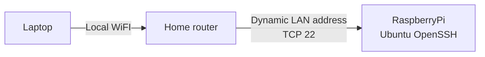
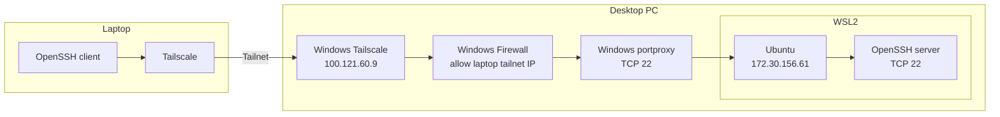
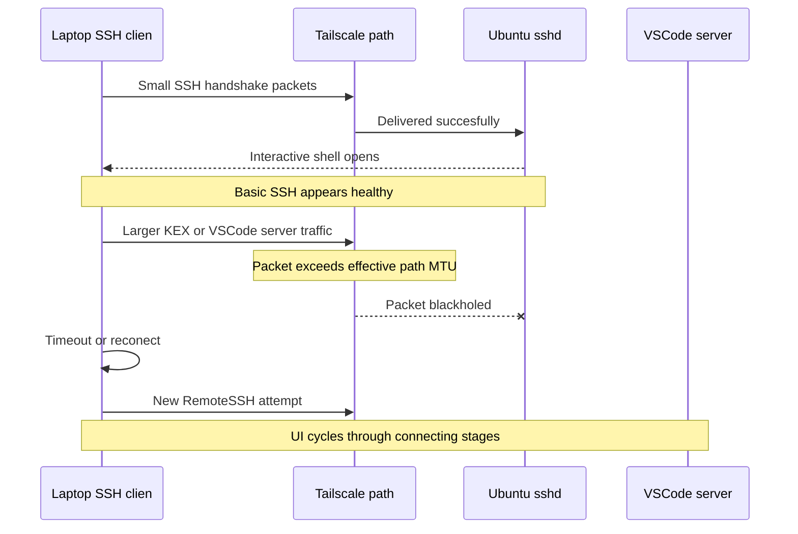
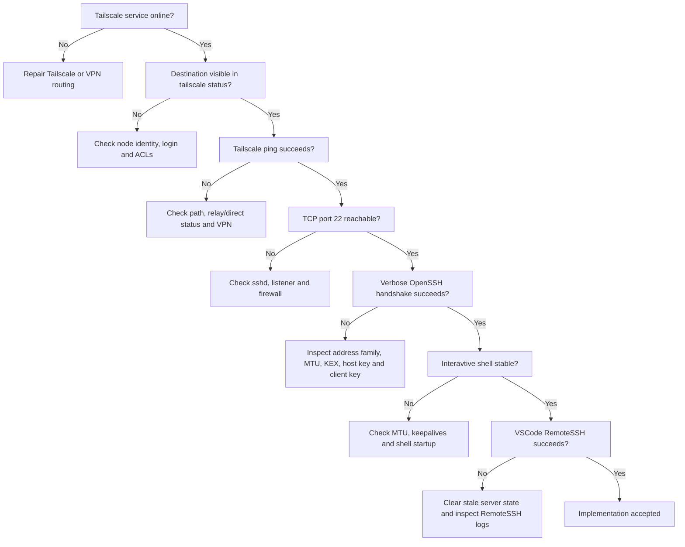
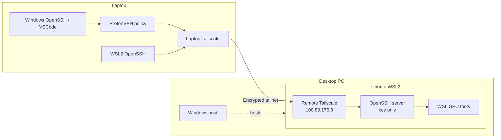
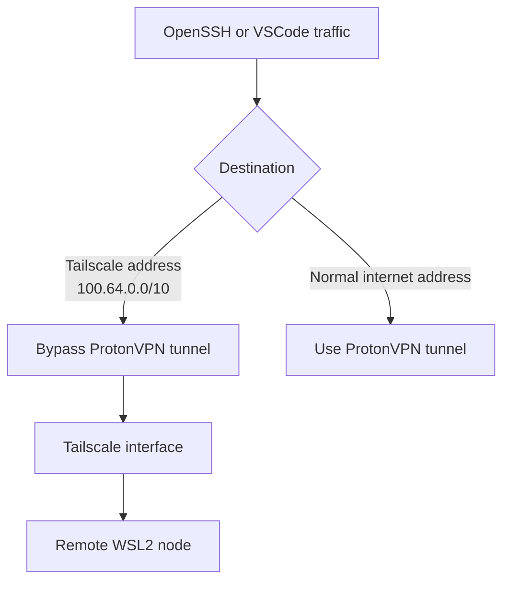
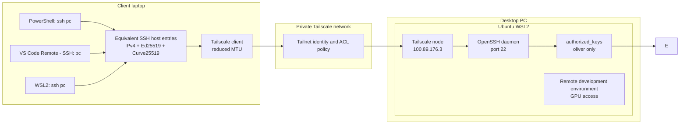
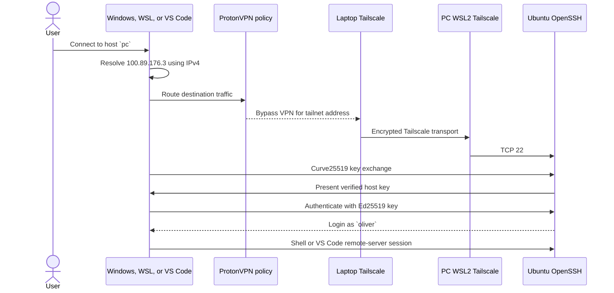

# Requirements

### Functional requirements: 
 * Allow for out of home [network](https://en.wikipedia.org/wiki/Computer_network) communication between *more powerfull* home computer, and laptop, which i use for most development.<sup><a href="#ref-s021">S021</a></sup>
 * Should be simple to connect, secure, fast, and avaliable from any network.
 * Connect from laptop to desktop with "[ssh](https://en.wikipedia.org/wiki/Secure_Shell) pc"<sup><a href="#ref-s017">S017</a></sup>
 * Supporrt connections from both [Windows](https://en.wikipedia.org/wiki/Microsoft_Windows) [PowerShell](https://learn.microsoft.com/en-us/powershell/) and [WSL2](https://en.wikipedia.org/wiki/Windows_Subsystem_for_Linux) [Ubuntu](https://en.wikipedia.org/wiki/Ubuntu) instance.<sup><a href="#ref-s019">S019</a>, <a href="#ref-s020">S020</a>, <a href="#ref-s026">S026</a>, <a href="#ref-s031">S031</a></sup>
 * Support [VSCode](https://en.wikipedia.org/wiki/Visual_Studio_Code) [Remote-SSH](https://code.visualstudio.com/docs/remote/ssh) useing the same `pc` alias.<sup><a href="#ref-s025">S025</a></sup>
 * Connect to the Ubuntu  WSL2 environment on the pc, nto the outer Windows [OpenSSH](https://en.wikipedia.org/wiki/OpenSSH) server.<sup><a href="#ref-s018">S018</a></sup>
 * Be suitable for development of performance intensive applications.
 * Be able to work away from home.

### Security requirements:
 * Use [publickey authentification](https://en.wikipedia.org/wiki/Public-key_cryptography).<sup><a href="#ref-s028">S028</a></sup>
 * Disable SSH [password authentification](https://en.wikipedia.org/wiki/Authentication). ( as to reject [brute force](https://en.wikipedia.org/wiki/Brute-force_attack) on open [port22](https://en.wikipedia.org/wiki/Port_(computer_networking)) )<sup><a href="#ref-s022">S022</a>, <a href="#ref-s030">S030</a></sup>
 * Do not expose port 22 through the [router](https://en.wikipedia.org/wiki/Router_(computing)).

# Initial design:

## Stage 0: Local network test SSH to [RaspberryPI](https://en.wikipedia.org/wiki/Raspberry_Pi)<sup><a href="#ref-s027">S027</a></sup>

First SSH workflow targeted a RaspberryPi by its own [local area network (LAN)](https://en.wikipedia.org/wiki/Local_area_network) [address](https://en.wikipedia.org/wiki/IP_address). [Command line](https://en.wikipedia.org/wiki/Command-line_interface) SSH worked, but the Pi's address later changed after netowrk changes, and VSCode did not consistently interpret the Windows SSH configuration.<sup><a href="#ref-s029">S029</a></sup>


```mermaid
flowchart LR
   L[Laptop] --> |Local WiFI| R[Home router]
   R -->|Dynamic LAN address<br/>TCP 22| PI[RaspberryPi<br/>Ubuntu OpenSSH]
```
### Probelems and fixes:

*a lot*

| Problem | Symptom | Cause | Fix | Outcome |
|   ---   |   ---   |  ---  | --- |   ---   |
|VSCode could not connect to the Pi although [shell](https://en.wikipedia.org/wiki/Shell_(computing)) SSH worked | [Remote-SSH](https://code.visualstudio.com/docs/remote/ssh) failed while `ssh mahkrab@192.168.0.58` succeeded | Inconsistent WIndows SSH host entries and VSCode targets | Standardised named host entries and connected VSCode to the alias, not to a pasted `ssh` command | Configuration became reusable by VSCode |
| The Pi became unreachable by its previous address | [SSH key](https://en.wikipedia.org/wiki/Key_(cryptography)) existed, but the other LAN IP no longer responded after [WiFi](https://en.wikipedia.org/wiki/Wi-Fi) maintence | [DHCP](https://en.wikipedia.org/wiki/Dynamic_Host_Configuration_Protocol) changed the Pi's LAN address<sup><a href="#ref-s023">S023</a></sup> | Rediscovered Pi and moved towards stable named SSH entries | Showed thr weakness of raw LAN addresses |

This model and problems established two points:

1. A named SSH host entry is better than repeatadly entering an address and username.
2. A dynamic LAN address is not a dependable identity.

## Stage 1: Windows [Tailscale](https://en.wikipedia.org/wiki/Tailscale) with forwarding into WSL2<sup><a href="#ref-s016">S016</a></sup>

The first desktop --> PC design ran Tailscale. Windows accepted traffic on its Tailscale address and forwarded [TCP](https://en.wikipedia.org/wiki/Transmission_Control_Protocol) port 22 to the changing WSL2 [NAT](https://en.wikipedia.org/wiki/Network_address_translation) address using [`netsh interface portproxy`](https://learn.microsoft.com/en-us/windows-server/networking/technologies/netsh/netsh-interface-portproxy).<sup><a href="#ref-s024">S024</a></sup>


```mermaid
flowchart LR
   subgraph Laptop
      SSH[OpenSSH client]
      LT[Tailscale]
   end

   subgraph Desktop_PC[Desktop PC]
      WT[Windows Tailscale<br/>100.121.60.9]
      FW[Windows Firewall<br/>allow laptop tailnet IP]
      PP[Windows portproxy<br/>TCP 22]
         subgraph WSL2
            U[Ubuntu<br/>172.30.156.61]
            S[OpenSSH server<br/>TCP 22]
         end
      end

      SSH --> LT
      LT -->|Tailnet| WT
      WT --> FW --> PP --> U --> S
```
<details>
<summary><b>SSH Config on laptop for PC:</b></summary>

```sshconfig
Host pc
   HostName oliverpc.taillab589b.ts.net
   User oliver
   IdentityFile ~/.ssh/id_ed25519
   IdentitiesOnly yes
```
</details>

### Limitations of the initial design:

- WSL2s NAT address could change after a restart.
- [`portproxy`](https://learn.microsoft.com/en-us/windows-server/networking/technologies/netsh/netsh-interface-portproxy) needed to be updated manuallly.
- Windows [Firewall](https://en.wikipedia.org/wiki/Firewall_(computing)), Windows Tailscale, [`portproxy`](https://learn.microsoft.com/en-us/windows-server/networking/technologies/netsh/netsh-interface-portproxy), WSL network, and Ubuntu SSH all had to be healthy at one time, or whole system fail.
- Troubleshooting crossed two vastly different [operating systems](https://en.wikipedia.org/wiki/Operating_system) and several layers ( Windows -> WSL2 )
- Both Windows and WSL could take different network paths despite using the same SSH command.

### Probelems and fixes:

*a lot more*

| Problem | Symptom | Cause | Fix | Outcome |
|   ---   |   ---   |  ---  | --- |   ---   |
| The PC design depended on Windows forwarding, which of course is unreliable | WSL SSH was reachable only through Windows Tailscale, Firewall, and [`portproxy`](https://learn.microsoft.com/en-us/windows-server/networking/technologies/netsh/netsh-interface-portproxy) | Tailscale was running on windows rather than inside the [Linux](https://en.wikipedia.org/wiki/Linux) environment | Installed and ran Tailscale directly in the PC's Ubuntu WSL2 instance | Removed the forwarding layer from the design |
| `ssh pc` selected an unusable destination | The Tailscale [dashboard](https://en.wikipedia.org/wiki/Dashboard_(computing)) showed the [node](https://en.wikipedia.org/wiki/Node_(networking)) online, but SSH attempted a [IPv6](https://en.wikipedia.org/wiki/IPv6) address with no working [route](https://en.wikipedia.org/wiki/Routing) | Address selection prefered an IPv6 path that was not usable end to end | Pointed `pc` directly to `100.89.176.3` and set [`AddressFamily inet`](https://man.openbsd.org/ssh_config#AddressFamily)<sup><a href="#ref-s033">S033</a></sup> | SSH consistently selected the working Tailscale [IPv4](https://en.wikipedia.org/wiki/Internet_Protocol_version_4) route |
| SSH connected then hung | WSL SSH stalled during *negotiation*, especially at [`sntrup`](https://en.wikipedia.org/wiki/NTRU) [key exchange](https://en.wikipedia.org/wiki/Key_exchange)<sup><a href="#ref-s034">S034</a></sup> | The larger [post-quantum](https://en.wikipedia.org/wiki/Post-quantum_cryptography) *fancy* key exchange [packets](https://en.wikipedia.org/wiki/Network_packet) exposed an [MTU](https://en.wikipedia.org/wiki/Maximum_transmission_unit) *[black hole](https://en.wikipedia.org/wiki/Path_MTU_Discovery)* through WSL2 and Tailscale [encapsulation](https://en.wikipedia.org/wiki/Encapsulation_(networking))<sup><a href="#ref-s032">S032</a></sup>| Preffered [`curve25519-sha256`](https://en.wikipedia.org/wiki/Curve25519) and reduced the effective tailscale MTU<sup><a href="#ref-s040">S040</a></sup> | Interactive SSH became reliable *finally* |
| VSCode repeatedly cycled through connection stages | Plain SSH worked, but [VSCode-RemoteSSH](https://code.visualstudio.com/docs/remote/ssh) repeatedly reconnected whule installing or starting its remote server | VSCode transferred more and larger data than a basic shell, triggering the same MTU problem | CLeared out old [processes](https://en.wikipedia.org/wiki/Process_(computing)) which started when connecting, shrank the [handshake](https://en.wikipedia.org/wiki/Handshaking) size (KEX), and forced network to only send smaller packets (MTU), then restarted the server | Removed the known causes of the connection loop |
| Tailscale failed on school WiFI while [VPN](https://en.wikipedia.org/wiki/Virtual_private_network) was active | [DNS](https://en.wikipedia.org/wiki/Domain_Name_System) lookup failed for the tailscale control; anotjer attempt returnede an invalid [certificate](https://en.wikipedia.org/wiki/Public_key_certificate) response<sup><a href="#ref-s038">S038</a></sup> | VPN or network interception effected DNS/[TLS](https://en.wikipedia.org/wiki/Transport_Layer_Security) traffic<sup><a href="#ref-s039">S039</a></sup> | Adjusted VPN routing so tailscale traffic bypassed the bad path | Thinned out issues with School Wi-Ff |
| Windows SSH returned `Permission denied` while WSL SSH worked | The same [alias](https://en.wikipedia.org/wiki/Alias_(command)) and key worked in WSL but failed at the windows [socket](https://en.wikipedia.org/wiki/Network_socket) layer | [ProtonVPN](https://en.wikipedia.org/wiki/Proton_VPN) applied different filtering to Windows OpenSSH and WSL traffic<sup><a href="#ref-s037">S037</a></sup> | Removed OpenSSH and VSCode application exclusions while keeping the Tailscale network exclusions | Windows `ssh pc` worked again on school Wifi |
| ProtonVPN [split-tunneling](https://en.wikipedia.org/wiki/Split_tunneling) changes caused [timeouts](https://en.wikipedia.org/wiki/Timeout_(computing)) | Combining application exclusions with Tailscale address exclusions changed routed unpredictably | Two overlapping split tunnel policies competed for the same traffic | Kept one routing strategy: exclidingthe Tailscale [address space](https://en.wikipedia.org/wiki/Address_space), but do not seperately exclude OpenSSH or VSCode | Windows and WSL followed a more consistent path |
| [RemoteSSH](https://code.visualstudio.com/docs/remote/ssh) retained stale state after failed attempts | VSCode continued cycling after route improved | Old local helper and remote VSCode server processes survived different attempts | Again terminated old helpers and restarted the remote server installation/session | Clean connection state |

### Why basic SSH passed while VSCode failed:


```mermaid
sequenceDiagram
   participant C as Laptop SSH clien 
   participant T as Tailscale path
   participant S as Ubuntu sshd
   participant V as VSCode server

   C->>T: Small SSH handshake packets
   T->>S: Delivered succesfully
   S-->>C: Interactive shell opens
   Note over C,S: Basic SSH appears healthy

   C->>T: Larger KEX or VSCode server traffic
   Note over T: Packet exceeds effective path MTU
   T--xS: Packet blackholed
   C->>C: Timeout or reconect
   C->>T: New RemoteSSH attempt
   Note over C,V: UI cycles through connecting stages
```

## Testing and problems discovered:

### Layered diagnostic method:

Testing was deliberately performed from the lowest [network layer](https://en.wikipedia.org/wiki/Network_layer) upward. This prevents an SSH authentification problem from being comfused with routing, VPN, or [transport](https://en.wikipedia.org/wiki/Transport_layer) problems. The method uses the Tailscale [`status`](https://tailscale.com/docs/reference/tailscale-cli#status) and [`ping`](https://tailscale.com/docs/reference/ping-types) commands and checks [access-control lists (ACLs)](https://en.wikipedia.org/wiki/Access-control_list) before testing SSH.<sup><a href="#ref-s035">S035</a>, <a href="#ref-s036">S036</a></sup>


```mermaid
flowchart TD
   A[Tailscale service online?] -->|No| A1[Repair Tailscale or VPN routing]
   A -->|Yes| B[Destination visible in tailscale status?]
   B -->|No| B1[Check node identity, login and ACLs]
   B -->|Yes| C[Tailscale ping succeeds?]
   C -->|No| C1[Check path, relay/direct status and VPN]
   C -->|Yes| D[TCP port 22 reachable?]
   D -->|No| D1[Check sshd, listener and firewall]
   D -->|Yes| E[Verbose OpenSSH handshake succeeds?]
   E -->|No| E1[Inspect address family, MTU, KEX, host key and client key]
   E -->|Yes| F[Interavtive shell stable?]
   F -->|No| F1[Check MTU, keepalives and shell startup]
   F -->|Yes| G[VSCode RemoteSSH succeeds?]
   G -->|No| G1[Clear stale server state and inspect RemoteSSH logs]
   G -->|Yes| H[Implementation accepted]
```

### Test matrix

| Test | Windows client | WSL2 client | Purpose | Important discovery |
|---|---:|---:|---|---|
| [`tailscale status`](https://tailscale.com/docs/reference/tailscale-cli#status) | Yes | Yes | Confirm local node and [peer](https://en.wikipedia.org/wiki/Peer-to-peer) visibility | Dashboard visibility alone did not prove a usable SSH route |
| [`tailscale ping 100.89.176.3`](https://tailscale.com/docs/reference/ping-types) | Yes | Yes | Test the [tailnet](https://tailscale.com/docs/concepts/tailnet) path without SSH | Helped separate Tailscale reachability from OpenSSH problems |
| TCP test to port 22 | Yes | Yes | Confirm that Ubuntu `sshd` was listening and reachable | A reachable port did not guarantee that larger SSH exchanges would survive |
| `ssh -vvv pc` | Yes | Yes | Inspect address selection, KEX, key use, and failure stage | Revealed unusable IPv6 selection and negotiation stalls |
| Forced IPv4 | Yes | Yes | Remove IPv6 route ambiguity | Produced deterministic routing to the WSL Tailscale node |
| Curve25519-only KEX | Yes | Yes | Test whether negotiation packet size triggered the failure | Avoided the larger exchange associated with the observed stall |
| Interactive `ssh pc` | Yes | Yes | Validate real shell access and key-only login | Worked after VPN and transport corrections |
| VS Code [Remote - SSH](https://code.visualstudio.com/docs/remote/ssh) | Yes | N/A | Validate server upload, startup and [port forwarding](https://en.wikipedia.org/wiki/Port_forwarding) | Exposed the MTU issue more reliably than a small shell session |
| School Wi-Fi with ProtonVPN | Yes | Yes | Validate operation on a restrictive external network | Showed that Windows and WSL followed different VPN policies |
| Remote identity commands | Yes | Yes | Confirm destination user, [hostname](https://en.wikipedia.org/wiki/Hostname), working directory, and [GPU](https://en.wikipedia.org/wiki/Graphics_processing_unit) tools<sup><a href="#ref-s012">S012</a></sup> | Ensured the session landed inside the intended Ubuntu WSL2 environment |


# Revised designs:

## Revision 1: direct Tailscale inside the destination WSL2 instance:

Tailscale was moved from the windows [host](https://en.wikipedia.org/wiki/Host_(network)) into Ubuntu WSL2. The laptop could then reach the same environment that ran `sshd`.


```mermaid
flowchart LR
   subgraph Laptop
      WC[Windows OpenSSH / VSCode]
      LC[WSL2 OpenSSH]
      VPN[ProtonVPN policy]
      LT[Laptop Tailscale]
   end

   subgraph Desktop_PC[Desktop PC]
      W[Windows host]
      subgraph Ubuntu_WSL2[Ubuntu WSL2]
         RT[Remote Tailscale<br/>100.89.176.3]
         SSHD[OpenSSH server<br/>key only]
         GPU[WSL GPU tools]
      end
   end

   WC --> VPN --> LT
   LC --> LT
   LT -->|Encrypted tailnet| RT
   RT --> SSHD --> GPU
   W -. hosts .-> Ubuntu_WSL2
```

Benefits:

- No windows [`portproxy`](https://learn.microsoft.com/en-us/windows-server/networking/technologies/netsh/netsh-interface-portproxy) in the normal [data path](https://en.wikipedia.org/wiki/Data_path).
- No dependency on the changing WSL NAT address.
- The Tailscale [identity](https://en.wikipedia.org/wiki/Digital_identity) belongs to the actual SSH destination.
- Fewer firewall and [forwarding](https://en.wikipedia.org/wiki/Packet_forwarding) layers.
- Easier reasoning about [logs](https://en.wikipedia.org/wiki/Logging_(computing)) and failures.

### Revision 2: client behavior

The [client](https://en.wikipedia.org/wiki/Client_(computing)) [configuration](https://en.wikipedia.org/wiki/Configuration_file) was hardened so both Windows and WSL used the intended address and key exchange behaviour.

Representive configuration:

```sshconfig
Host pc
   HostName 100.89.176.3
   User oliver
   IdentityFile ~/.ssh/id_ed25519
   IdentitiesOnly yes
   AddressFamily inet
   KexAlgorithms curve25519-sha256
   ConnectTimeout 15
   ServerAliveInterval 30
   ServerAliveCountMax 3
```

Windows and WSL maintain seperate physical SSH configuration files, so this logical entry must remain equivalent in btoh environments:

- Windows: `\.ssh\config`
- WSL2 `~/.ssh/config`

## Revision 3: single VPN-routing policy

The final VPN rule seperates Tailscale network routing from application selection:


```mermaid
flowchart TD
   APP[OpenSSH or VSCode traffic] --> DEST{Destination}
   DEST -->|Tailscale address<br/>100.64.0.0/10| BYPASS[Bypass ProtonVPN tunnel]
   DEST -->|Normal internet address| VPN[Use ProtonVPN tunnel]
   BYPASS --> TS[Tailscale interface]
   TS --> PC[Remote WSL2 node]
```

OpenSSH and VSCode are not independently excluded as applications. This avoids two split-tunneling mechanisms over the same [connection](https://en.wikipedia.org/wiki/Connection-oriented_communication).

# Final implementation

### Architecture


```mermaid
flowchart LR
    subgraph Client_Laptop[Client laptop]
        P[PowerShell: ssh pc]
        VS[VS Code Remote - SSH: pc]
        WL[WSL2: ssh pc]
        CFG[Equivalent SSH host entries<br/>IPv4 + Ed25519 + Curve25519]
        TS1[Tailscale client<br/>reduced MTU]
    end

    subgraph Tailnet[Private Tailscale network]
        ACL[Tailnet identity and ACL policy]
    end

    subgraph Desktop[Desktop PC]
        subgraph WSL[Ubuntu WSL2]
            TS2[Tailscale node<br/>100.89.176.3]
            SD[OpenSSH daemon<br/>port 22]
            AU[authorized_keys<br/>oliver only]
            ENV[Remote development environment<br/>GPU access]
        end
    end

    P --> CFG
    VS --> CFG
    WL --> CFG
    CFG --> TS1
    TS1 --> ACL --> TS2 --> SD --> AU --> E
```

### Connection sequence


```mermaid
sequenceDiagram
    actor U as User
    participant C as Windows, WSL, or VS Code
    participant V as ProtonVPN policy
    participant T1 as Laptop Tailscale
    participant T2 as PC WSL2 Tailscale
    participant S as Ubuntu OpenSSH

    U->>C: Connect to host `pc`
    C->>C: Resolve 100.89.176.3 using IPv4
    C->>V: Route destination traffic
    V-->>T1: Bypass VPN for tailnet address
    T1->>T2: Encrypted Tailscale transport
    T2->>S: TCP 22
    C->>S: Curve25519 key exchange
    S->>C: Present verified host key
    C->>S: Authenticate with Ed25519 key
    S-->>C: Login as `oliver`
    C->>S: Shell or VS Code remote-server session
```

### Security properties

- The router exposes no inbound SSH port.
- The Ubuntu SSH [server](https://en.wikipedia.org/wiki/Server_(computing)) is recheable through [tailnet](https://tailscale.com/docs/reference/glossary#tailnet), not public [internet](https://en.wikipedia.org/wiki/Internet).
- Authentication is possession based through an [Ed25519](https://en.wikipedia.org/wiki/EdDSA#Ed25519) private key.<sup><a href="#ref-s041">S041</a></sup>
- [Password](https://en.wikipedia.org/wiki/Password) and [root](https://en.wikipedia.org/wiki/Superuser) SSH login remain disabled.
- The host alias always targets the Ubuntu WSL2 Tailscale identity.
- Tailscale [encrypts](https://en.wikipedia.org/wiki/Encryption) transport between the two enrolled devices.
- The design does not depend on Windows OpenSSH server.

# Evaluation

### What worked well:

- Moving Tailscale into the destination WSL2 instance greatly simplified the design.
- The direct Tailscale IPv4 address removed both WSL NAT changing and IPv6 route ambiguity.
- Key only OpenSSH preserved strong [security](https://en.wikipedia.org/wiki/Computer_security) without exposing port 22 publically.
- Layered testing succesfully seperated routing, transport, authentification, shell, and VSCode failures.
- Testing from both Windows and WSL revealed ProtonVPN policy differences that single client testing would have missed.
- VSCode acted as [stress test](https://en.wikipedia.org/wiki/Stress_testing_(software)) and exposed MTU faults normal ssh would of missed.

### Weaknesses: 

- Using a literal Tailscale IPv4 address is less stable than a [MagicDNS](https://tailscale.com/docs/features/magicdns) name.<sup><a href="#ref-s042">S042</a></sup>
- Windows and WSL have seperate SSH configuration files that can *[drift](https://en.wikipedia.org/wiki/Concept_drift#Data_configuration_decay)* apart.
- Restricting KEX to Curve25519 sacrifices the *hybrid post quantum exchange* until the MTU problem is corrected at the network layer.
- Reducing the laptop Tailscale MTU is a workaround, and may reduce output slightly.

# Conclusion

Moved form fragile, multi-layer forwarding design to direct and secure Linux -> Linux [endpoint](https://en.wikipedia.org/wiki/Communication_endpoint) over Tailscale in the same WSL2 environment as the OpenSSH server.

The final implementation meets the requirements.

## References used

- <a name="ref-s012"></a> **S012 — NVIDIA Corporation (2026).** *CUDA Programming Guide*, Release 13.2. [Source record](/docs/research/sources/012-nvidia-cuda-programming-guide-release-13-2.md).
- <a name="ref-s016"></a> **S016 — Tailscale Inc. (2025).** ‘What is Tailscale?’. [Source record](/docs/research/sources/016-tailscale-what-is-tailscale.md).
- <a name="ref-s017"></a> **S017 — Cloudflare Inc. (n.d.).** ‘What is SSH? Secure Shell (SSH) protocol’. [Source record](/docs/research/sources/017-cloudflare-what-is-ssh.md).
- <a name="ref-s018"></a> **S018 — OpenBSD Project (n.d.).** ‘OpenSSH’. [Source record](/docs/research/sources/018-openbsd-openssh.md).
- <a name="ref-s019"></a> **S019 — Microsoft (2025).** ‘What is the Windows Subsystem for Linux?’. [Source record](/docs/research/sources/019-microsoft-what-is-wsl.md).
- <a name="ref-s020"></a> **S020 — Canonical Ltd. (2026).** ‘Ubuntu on WSL’. [Source record](/docs/research/sources/020-canonical-ubuntu-on-wsl.md).
- <a name="ref-s021"></a> **S021 — Cloudflare Inc. (n.d.).** ‘What is a LAN (local area network)?’. [Source record](/docs/research/sources/021-cloudflare-what-is-a-lan.md).
- <a name="ref-s022"></a> **S022 — Cloudflare Inc. (n.d.).** ‘What is a computer port? Ports in networking’. [Source record](/docs/research/sources/022-cloudflare-computer-ports.md).
- <a name="ref-s023"></a> **S023 — Microsoft (2022).** ‘DHCP (Dynamic Host Configuration Protocol) Basics’. [Source record](/docs/research/sources/023-microsoft-dhcp-basics.md).
- <a name="ref-s024"></a> **S024 — Microsoft (2025).** ‘Accessing network applications with WSL’. [Source record](/docs/research/sources/024-microsoft-wsl-networking.md).
- <a name="ref-s025"></a> **S025 — Microsoft (2026).** ‘Remote Development using SSH’. [Source record](/docs/research/sources/025-microsoft-vscode-remote-ssh.md).
- <a name="ref-s026"></a> **S026 — Microsoft (2025).** ‘What is PowerShell?’. [Source record](/docs/research/sources/026-microsoft-what-is-powershell.md).
- <a name="ref-s027"></a> **S027 — Raspberry Pi Ltd. (n.d.).** ‘About us’. [Source record](/docs/research/sources/027-raspberry-pi-about.md).
- <a name="ref-s028"></a> **S028 — OpenBSD Project (n.d.).** ‘sshd_config(5)’. [Source record](/docs/research/sources/028-openbsd-sshd-config.md).
- <a name="ref-s029"></a> **S029 — Cloudflare Inc. (n.d.).** ‘What is my IP address?’. [Source record](/docs/research/sources/029-cloudflare-ip-addresses.md).
- <a name="ref-s030"></a> **S030 — Cloudflare Inc. (n.d.).** ‘What is a brute force attack?’. [Source record](/docs/research/sources/030-cloudflare-brute-force-attacks.md).
- <a name="ref-s031"></a> **S031 — Microsoft (n.d.).** ‘Windows technical documentation for developers and IT pros’. [Source record](/docs/research/sources/031-microsoft-windows-documentation.md).
- <a name="ref-s032"></a> **S032 — Lahey (2000).** *TCP Problems with Path MTU Discovery*. RFC 2923. [Source record](/docs/research/sources/032-rfc-2923-path-mtu-discovery.md).
- <a name="ref-s033"></a> **S033 — OpenBSD Project (n.d.).** ‘ssh_config(5)’. [Source record](/docs/research/sources/033-openbsd-ssh-config.md).
- <a name="ref-s034"></a> **S034 — OpenSSH Project (2026).** ‘OpenSSH Release Notes’. [Source record](/docs/research/sources/034-openssh-release-notes.md).
- <a name="ref-s035"></a> **S035 — Tailscale Inc. (2026).** ‘Manage permissions using ACLs’. [Source record](/docs/research/sources/035-tailscale-acls.md).
- <a name="ref-s036"></a> **S036 — Tailscale Inc. (2026).** ‘Tailscale CLI’. [Source record](/docs/research/sources/036-tailscale-cli.md).
- <a name="ref-s037"></a> **S037 — Proton AG (n.d.).** ‘How to use split tunneling’. [Source record](/docs/research/sources/037-proton-vpn-split-tunneling.md).
- <a name="ref-s038"></a> **S038 — Cloudflare Inc. (n.d.).** ‘What is DNS?’. [Source record](/docs/research/sources/038-cloudflare-what-is-dns.md).
- <a name="ref-s039"></a> **S039 — Cloudflare Inc. (n.d.).** ‘What is Transport Layer Security?’. [Source record](/docs/research/sources/039-cloudflare-what-is-tls.md).
- <a name="ref-s040"></a> **S040 — Adamantiadis, Josefsson and Baushke (2020).** *Secure Shell (SSH) Key Exchange Method Using Curve25519 and Curve448*. RFC 8731. [Source record](/docs/research/sources/040-rfc-8731-curve25519-ssh.md).
- <a name="ref-s041"></a> **S041 — Harris and Velvindron (2020).** *Ed25519 and Ed448 Public Key Algorithms for the Secure Shell (SSH) Protocol*. RFC 8709. [Source record](/docs/research/sources/041-rfc-8709-ed25519-ssh.md).
- <a name="ref-s042"></a> **S042 — Tailscale Inc. (2026).** ‘MagicDNS’. [Source record](/docs/research/sources/042-tailscale-magicdns.md).
